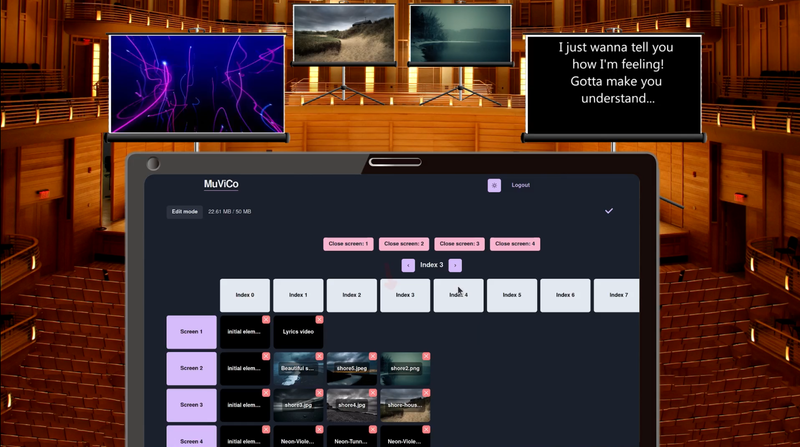

# MuViCo

### Introduction

MuviCo is a browser-based application designed to provide versatile visual elements and support functions for live music performances. The purpose of the application is to bring an additional dimension to music experiences that can complement and enrich the experience for both listeners and performers.

With MuViCo you can easily add, assemble and edit video, image and audio elements on an interactive interface. Your projects are saved to the cloud, so they can be accessed from any device at any time.

### Used technologies

#### Backend

- [Node.js](https://nodejs.org/en/learn/getting-started/introduction-to-nodejs)
- [Express.js](https://expressjs.com/en/5x/api.html)

#### Frontend

- [React](https://react.dev/learn)
- JavaScript (ES6+)

#### Testing

- [Jest](https://jestjs.io/docs/tutorial-react)

#### Database

- [mongodb](https://www.mongodb.com/)

### Use

The app can be used by signing up and logging in. The user can log in with a Google account or create a new account to MuViCo. On the home page the user can create a new presentation or view their previous presentations. A presentation in this case refers to a collection of media, which is intended to be used in a performance setting.

Elements are slots in which singular pieces of media are stored. On the presentation page, the user can add elements either by manually clicking the 'Add element'-button, by double clicking on a free spot in the interface, or by drag-and-dropping files directly to the interface. The user can then edit existing elements for example by dragging a new piece of media on top of the element or by double clicking the element to change the position, element name or media. Changes are saved automatically.

Once the user enters 'Show mode' the elements can be activated. Each element is linked to a screen on which the media will be presented. The presentation can also be edited during Show mode and changes will be saved.

The elements are differentiated by their 'screen' and 'index' values. Elements with the same 'screen' are shown in the same pop up window, while elements with the same 'index' are activated simultaneously. This allows the user to control media on several screens independently. A user can delete a presentation or element, which also deletes the media of said presentation / element.

### Documentation

For detailed instructions on how to use the application check out the [User Guide](https://github.com/MuViCo/MuViCo/blob/3fa0f45fdeec4fe03a244c961004a385991dd78b/documentation/userguide.md)

For more information check out the [documentation folder](https://github.com/MuViCo/MuViCo/tree/main/documentation).

## Development

1. Install npm, docker and docker compose
2. Clone repository to local machine `git clone git@github.com:MuViCo/MuViCo.git`
3. Change directory to project root `cd MuViCo`
4. Copy .env-template as .env and fill the required values
5. Install depedencies `npm i`
6. Run `npm start`

Note: You can also start developing by just running `npm run dev` after all dependencies are installed and .env is configured
