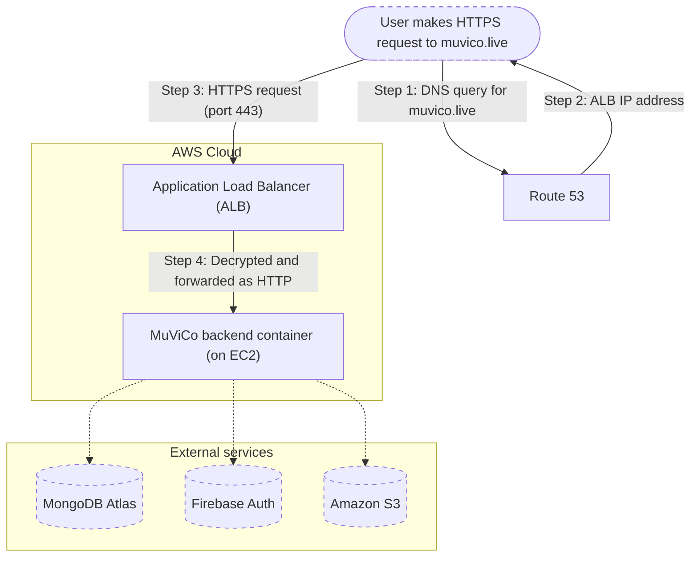
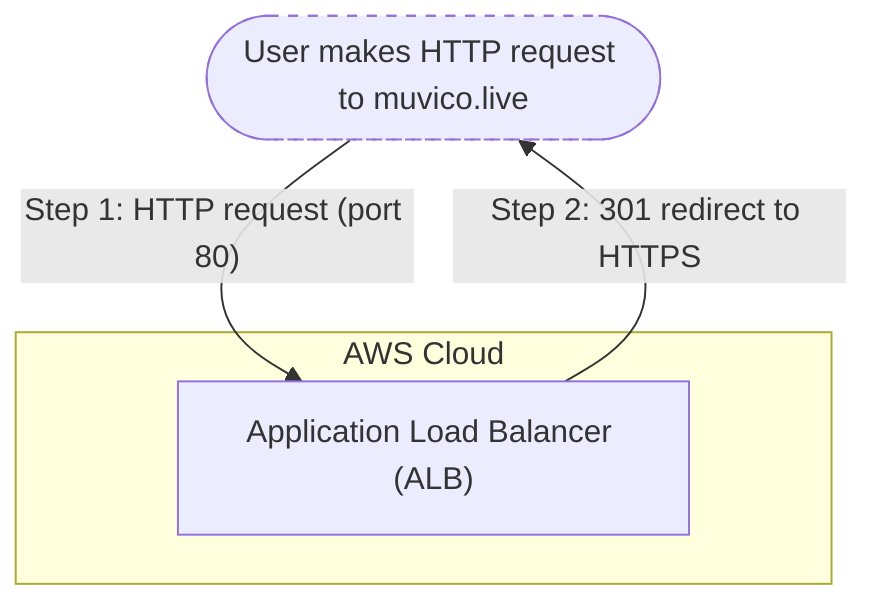

  

# MuViCo cloud deployment overview

This document provides a high-level overview of how MuViCo is deployed to the cloud for live production use. It is intended for current and future developers of the project who want an intuitive understanding of the production environment.

Information about local development or testing environments is out of scope for this document.

---

## 1. Introduction

MuViCo is a full-stack web application built with React (frontend) and Node.js + Express (backend), deployed in the cloud using Amazon Web Services (AWS). It is publicly accessible at [https://muvico.live](https://muvico.live).

The application is designed for creating and performing multi-screen multimedia shows, supporting a wide range of image, video, and audio file formats. Example use cases include standalone audiovisual pieces or providing real-time media backdrops for concerts and other live performances.

---

## 2. Services used by MuViCo

### Compute & container orchestration

- **[AWS Elastic Cloud Compute (EC2)](https://docs.aws.amazon.com/AWSEC2/latest/UserGuide/concepts.html)**  
  Provides the virtual machines that run the containers serving MuViCo.

- **[AWS Elastic Container Registry (ECR)](https://docs.aws.amazon.com/AmazonECR/latest/userguide/what-is-ecr.html)**  
  Stores built container images. The build process is detailed in [Section 4](#4-cicd-how-production-deployments-are-automated).

- **[AWS Elastic Container Service (ECS)](https://docs.aws.amazon.com/AmazonECS/latest/developerguide/Welcome.html)**  
  Orchestrates the containerized MuViCo application using the EC2 launch type.
  - ECS runs the application as a task inside an ECS cluster, which groups together one or more EC2 instances for running containers.
  - The cluster is backed by an Auto Scaling Group that can scale capacity based on demand.
  - ECS retrieves the latest container image from ECR. It manages the container lifecycle by starting, stopping, and restarting containers on EC2 instances in the cluster.

>[!TIP]
> **What are containers, ECS, and EC2, and how do they interact?**
>
> - The MuViCo application runs inside a container, which bundles everything it needs to run — code, dependencies, runtime, and the optimized production frontend.
> - ECS is the container orchestrator. It decides when and how containers run based on configuration and usage. It also handles updates and restarts.
> - EC2 is the virtual machine that runs the container. In this setup, ECS uses an EC2 instance to host the container.

### Networking

- **[AWS Application Load Balancer (ALB)](https://docs.aws.amazon.com/elasticloadbalancing/latest/application/introduction.html)**  
  Terminates incoming HTTPS connections, redirects HTTP requests to HTTPS, and forwards traffic to the container.

- **[AWS Route 53](https://docs.aws.amazon.com/Route53/latest/DeveloperGuide/Welcome.html)**  
  Handles DNS resolution by routing user traffic to `muvico.live` to the public IP address of the ALB.  
  The domain name `muvico.live` was also registered and is managed through Route 53.

- **[AWS Certificate Manager (ACM)](https://docs.aws.amazon.com/acm/latest/userguide/acm-overview.html)**  
  Issues and manages the SSL/TLS certificate of `muvico.live` for HTTPS.

- **[AWS Virtual Private Cloud (VPC)](https://docs.aws.amazon.com/vpc/latest/userguide/what-is-amazon-vpc.html)**  
  Provides a private virtual network for running the application infrastructure.

### Storage & database

- **[AWS Simple Storage Service (S3)](https://docs.aws.amazon.com/AmazonS3/latest/userguide/Welcome.html)**  
  Stores presentation media files uploaded by users.

- **[MongoDB Atlas](https://www.mongodb.com/)**  
  Stores user and presentation data.

### Authentication

- **[Firebase Auth](https://firebase.google.com/products/auth)**  
  Handles user login and authentication.

### Secrets management

- **[AWS Secrets Manager](https://docs.aws.amazon.com/secretsmanager/latest/userguide/intro.html)**  
  Used for securely storing and accessing environment variables like API keys and database URIs in the cloud.

---

## 3. Infrastructure diagrams and request flow

### 3.1. Figure 1: HTTPS request routing with TLS termination at ALB

This diagram illustrates how HTTPS requests reach the MuViCo production server, including DNS resolution and TLS termination.

### 3.2. Figure 2: HTTP-to-HTTPS redirection via ALB

This diagram shows how the ALB handles insecure HTTP traffic by redirecting it to HTTPS.

> [!NOTE]
> **What's a 301 redirect response?**
>
> A 301 redirect is a permanent redirect that tells the user's browser to retry the request using HTTPS. This is a standard best practice for enforcing secure connections.

## 4. CI/CD: How production deployments are automated

MuViCo uses GitHub Actions to automate production deployments.

Whenever changes are pushed to the `main` branch, GitHub Actions:

- Builds a new Docker image using environment secrets  
- Tags it as `latest` and pushes it to Amazon ECR  
- Renders a new ECS task definition with the freshly built image  
- Deploys the updated task definition to the ECS cluster

ECS then takes over to:

- Launch the new container using the updated image
- Replace the old container with the new version using rolling deployment
  - This ensures near-zero disruption: users can typically continue using the app while the update is in progress, though a brief window of unavailability might occur.

This process ensures that [https://muvico.live](https://muvico.live) is automatically updated after every successful push to `main`.

Refer to [/.github/workflows/production.yml](/.github/workflows/production.yml) for the full GitHub Actions workflow file.

---

## 5. Operational tips

- **Manual redeploy**: Trigger a manual deployment by pushing a new commit to main, or re-running the GitHub Actions workflow.

- **Secrets access**: Environment variables are securely retrieved from AWS Secrets Manager and injected into the container at runtime.

## 6. Notes

This document covers only the cloud production deployment of MuViCo. For local development setup, contribution guidelines, and environment configuration, refer to [/README.md](/README.md) and other documentation in [/documentation/](/documentation/).
