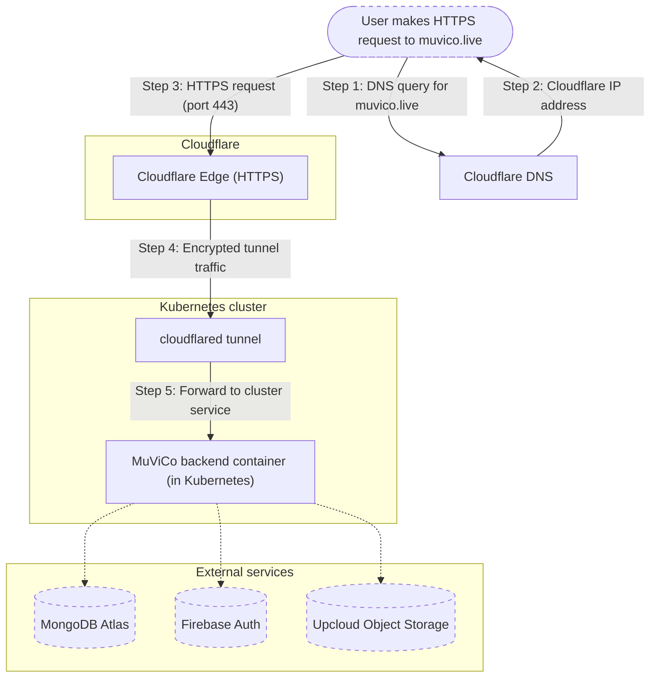
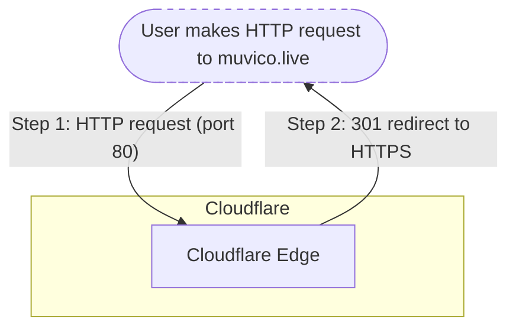

<p align="center">
  
</p>

# MuViCo cloud deployment overview

This document provides a high-level overview of how MuViCo is deployed to the cloud for live production use. It is intended for current and future developers of the project who want an intuitive understanding of the production environment.

Information about local development or testing environments is out of scope for this document.

---

## 1. Introduction

MuViCo is a full-stack web application built with React (frontend) and Node.js + Express (backend), deployed in the cloud on an Upcloud Kubernetes cluster. It is publicly accessible at [https://muvico.live](https://muvico.live).

The application is designed for creating and performing multi-screen multimedia shows, supporting a wide range of image, video, and audio file formats. Example use cases include standalone audiovisual pieces or providing real-time media backdrops for concerts and other live performances.

---

## 2. Services used by MuViCo

### Compute & container orchestration

- **[Upcloud Kubernetes](https://upcloud.com/docs/products/managed-kubernetes)**  
  Runs the MuViCo backend in a managed Kubernetes cluster. The deployment manifests live under `/manifests/` and are applied to the cluster using `kubectl`.

- **[Quay.io](https://quay.io/)**  
  Container registry used to store built images. The CI pipeline builds images from the repository and pushes them to Quay (tags include `staging` and release tags).

- **Docker**  
  The application is packaged as a Docker image using the project `Dockerfile`, which contains both the frontend build and the backend server.

### Networking

- **Cloudflare DNS + Tunnel**  
  The `muvico.live` and `staging.muvico.live` domains are managed in Cloudflare. A Cloudflare Tunnel (cloudflared) runs inside the Kubernetes cluster and accepts incoming traffic from Cloudflare.

- **TLS certificates**  
  TLS is handled by Cloudflare, which terminates HTTPS traffic at the edge and forwards it securely through the tunnel to the cluster.

- **Upcloud Object Storage**  
  Stores presentation media files uploaded by users (S3-compatible API).

- **[MongoDB Atlas](https://www.mongodb.com/)**  
  Stores user and presentation data.

### Google Drive integration

- **[Firebase Auth](https://firebase.google.com/products/auth)**  
  Handles user authentication.

### Secrets management

- **GitHub Secrets**  
  Sensitive configuration (API keys, database URIs, etc.) is stored in GitHub Secrets for CI.
- **Kubernetes Secrets**  
  Prod and staging configuration (API keys, database URIs, etc.) in Kubernetes Secrets for the running cluster (see `/manifests/*-secrets.yaml`).
  > [!CAUTION]
  > *These files are not to be saved in version control.*s

---

## 3. Infrastructure diagrams and request flow

### 3.1. Figure 1: HTTPS request routing with Cloudflare Tunnel

This diagram illustrates how HTTPS requests reach the MuViCo production server, including DNS resolution and TLS termination.


```mermaid
flowchart TD
    User(["User makes HTTPS request to muvico.live"])
    DNS["Cloudflare DNS"]
    CF["Cloudflare Edge (HTTPS)"]
    Tunnel["cloudflared tunnel"]
    Container["MuViCo backend container (in Kubernetes)"]

    classDef external stroke-dasharray: 5 5

    %% DNS resolution
    User:::external -->|"Step 1: DNS query for muvico.live"| DNS
    DNS -->|"Step 2: Cloudflare IP address"| User

    %% HTTPS request flow
    User -->|"Step 3: HTTPS request (port 443)"| CF
    CF -->|"Step 4: Encrypted tunnel traffic"| Tunnel
    Tunnel -->|"Step 5: Forward to cluster service"| Container

    subgraph "Cloudflare"
        CF
    end

    subgraph "Kubernetes cluster"
        Tunnel
        Container
    end

    subgraph "External services"
        Container -.-> M[(MongoDB Atlas)]:::external
        Container -.-> F[(Firebase Auth)]:::external
        Container -.-> S[(Upcloud Object Storage)]:::external
    end
```

### 3.2. Figure 2: HTTP-to-HTTPS redirection via Cloudflare

This diagram shows how Cloudflare redirects insecure HTTP traffic to HTTPS.


```mermaid
flowchart TD
    User(["User makes HTTP request to muvico.live"])
    CF["Cloudflare Edge"]

    classDef external stroke-dasharray: 5 5

    User:::external -->|"Step 1: HTTP request (port 80)"| CF
    CF -->|"Step 2: 301 redirect to HTTPS"| User

    subgraph "Cloudflare"
        CF
    end
```

> [!NOTE]
> **What's a 301 redirect response?**
>
> A 301 redirect is a permanent redirect that tells the user's browser to retry the request using HTTPS. This is a standard best practice for enforcing secure connections.

## 4. CI/CD: How production deployments are automated

MuViCo uses GitHub Actions to automate testing, building container images, and preparing releases.

### What the GitHub Actions workflows do

- **`staging.yml`** runs on every push (any branch):
  - Runs linting and unit tests.
  - Builds a Docker image and pushes it to Quay tagged with `staging`.
  - Uploads frontend and backend coverage reports to Codecov.

- **`prod.yml`** runs when a GitHub Release is published:
  - Builds a Docker image and pushes it to Quay tagged with the release name (e.g. `v1.2.3`).

### Deploying to Upcloud Kubernetes

Production and staging are deployed to an Upcloud Kubernetes cluster. Deployment manifests live in the `/manifests/` directory.

To deploy an updated image to the cluster:

1. Ensure you have access to the cluster kubeconfig (`muvico-cluster_kubeconfig.yaml`) and that `kubectl` is installed.
2. Apply (or re-apply) the manifests:

```bash
kubectl --kubeconfig=muvico-cluster_kubeconfig.yaml apply -f manifests/
```

3. If the image tag updated (e.g. a new `staging` build or a new release tag), restart the deployment so it pulls the new image:

```bash
kubectl --kubeconfig=muvico-cluster_kubeconfig.yaml rollout restart deployment muvico-{staging-}dep
```

This process ensures that [https://muvico.live](https://muvico.live) is running the latest container image produced by the CI pipeline.

---

## 5. Operational tips

- **Manual redeploy**: Trigger a redeployment by re-applying the Kubernetes manifests (see above).

## 6. Notes

This document covers only the cloud production deployment of MuViCo. For local development setup, contribution guidelines, and environment configuration, refer to [/README.md](/README.md) and other documentation in [/documentation/](/documentation/).
