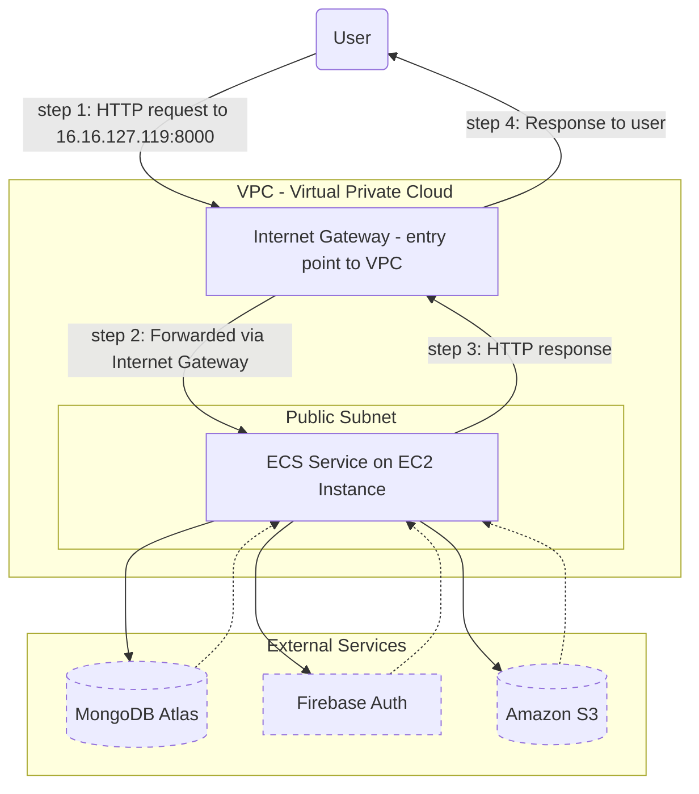
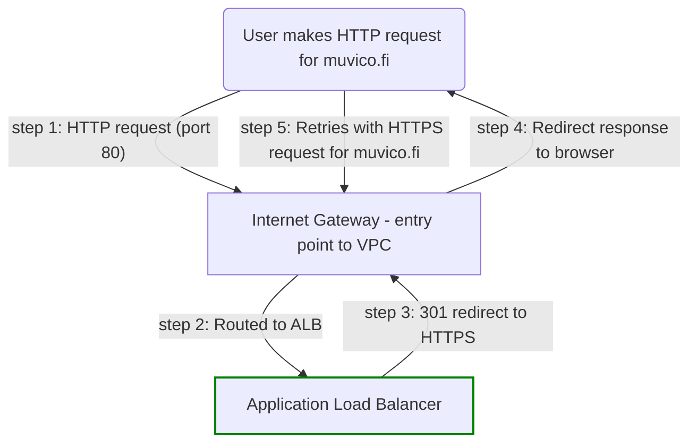
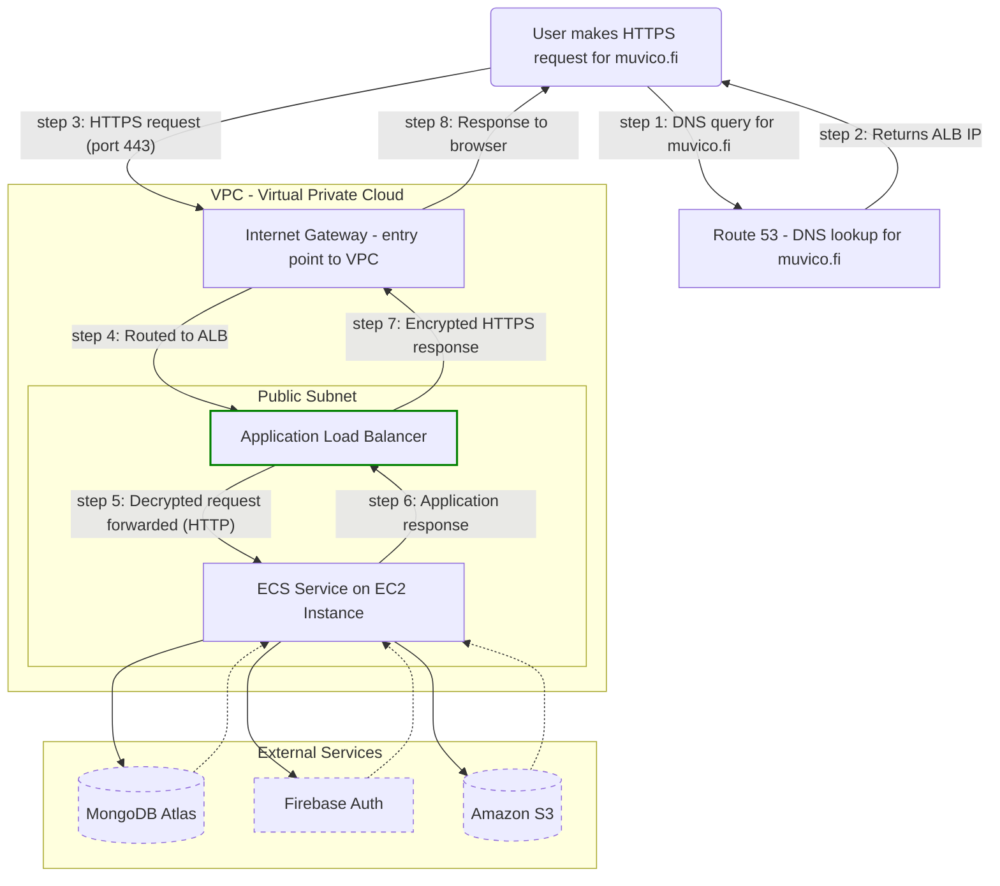
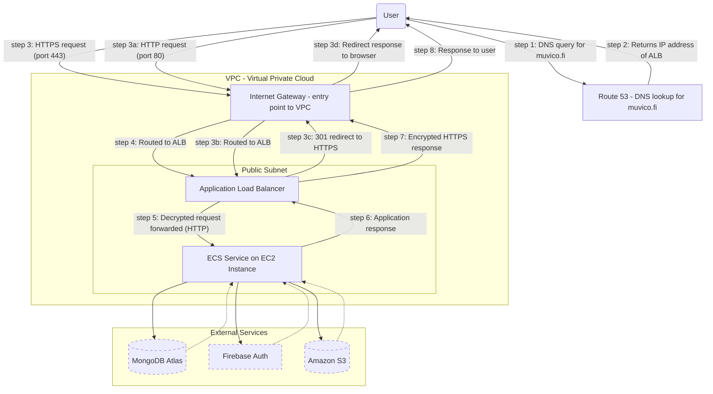

# Issue #309: Solution for implementing HTTPS connection via AWS.

> [!NOTE]
> This document outlines the steps for implementing secure HTTPS connections for MuViCo using AWS services.  
> It provides answers to the important questions: “Why?”, “How?”, “How much does it cost?”, and “What is life?”.

#### Why HTTPS?

- Secure user data transmission. No tea spilled.
- User-friendly and trustworthy URL (e.g., `https://muvico.fi`)

#### Why AWS services?

- Streamlined integration with the existing AWS infrastructure
- Full-AWS integration allows for convenient features such as automatic SSL certificate renewal

---

## 1. Technical context and motivation.

MuViCo is a full-stack web application built with React (frontend) and Node.js + Express (backend), deployed on [Amazon ECS](https://aws.amazon.com/ecs/), which manages containers that run on virtual machines called EC2 instances.

The backend connects to external services:

- [MongoDB Atlas](https://www.mongodb.com/atlas) for database storage
- [Firebase](https://firebase.google.com/) for authentication
- [Amazon S3](https://aws.amazon.com/s3/) for media file storage

---

### 1.1. What's wrong with the current implementation?

#### Security concerns:

- User data – including media uploads, login credentials, and authentication tokens – is transmitted in plaintext over HTTP
- Anyone intercepting network traffic (e.g. on public Wi-Fi) could access this data

#### Worse user experience:

- Browsers display warnings about insecure HTTP connections, which can reduce user trust
- Accessing the app via a raw IP (`http://16.16.127.119:8000`) is neither professional nor user-friendly

---

## 2. How is MuViCo currently running in the cloud?

MuViCo currently runs on a single EC2 instance inside a public subnet of a [Virtual Private Cloud (VPC)](https://aws.amazon.com/vpc/). This instance hosts the Docker container that runs the application. The container itself is managed by [ECS (Elastic Container Service)](https://aws.amazon.com/ecs/), which ensures it stays running and can restart it if needed.

The instance is directly accessible through its public IP: [http://16.16.127.119:8000](http://16.16.127.119:8000)

### What services are used?

- [Amazon ECS](https://aws.amazon.com/ecs): Manages containerized applications
- [Amazon EC2](https://aws.amazon.com/ec2): Provides the virtual machine that runs the container
- [Amazon ECR](https://aws.amazon.com/ecr): Stores the built container image
- [AWS Secrets Manager](https://aws.amazon.com/secrets-manager): Secures environment variables like database URIs and Firebase keys
- [Amazon S3](https://aws.amazon.com/s3): Stores presentation media
- [Amazon VPC](https://aws.amazon.com/vpc): Provides networking and isolation for the instance
- [NLB (Network Load Balancer)](https://aws.amazon.com/elasticloadbalancing/network-load-balancer): Exists in the setup but is not in use (no listeners or targets configured)

> [!TIP]
> Confused about the difference between ECS and EC2?
>
> - Amazon ECS (Elastic Container Service) is the container orchestrator — it handles deploying, starting, stopping, and monitoring containers.
> - Amazon EC2 (Elastic Compute Cloud) is the virtual machine (VM) that runs those containers executing the MuViCo application.

---

### How does traffic get in and out of this thing?

- Incoming traffic reaches the EC2 instance via the public IP through the Internet Gateway
- Outbound traffic (e.g., API responses or requests to external services) works because:
  - The EC2 instance has a public IPv4 address
  - The Internet Gateway handles the routing of outbound traffic
  - The security group and routing tables allow outbound traffic

---

## 3. What does the current setup look like?

> [!TIP]
> Shows how traffic flows over HTTP currently, with no HTTPS or domain in use.



> [!NOTE]
> The Internet Gateway handles all traffic entering and leaving the Virtual Private Cloud.

---

## 4. How do we actually add HTTPS?

To enable secure HTTPS access, it's recommended to deploy an **Application Load Balancer (ALB)** that:

- Handles **TLS termination** and redirects all HTTP traffic to HTTPS
- Integrates with **AWS Certificate Manager (ACM)** for automatic SSL certificate management
- Works with **Amazon Route 53** to route traffic from a custom domain (e.g. `https://muvico.fi`)

> [!TIP]
> **TLS termination** means that the ALB decrypts incoming HTTPS traffic and forwards it to ECS containers over plain HTTP.

---

### What changes?

- Incoming traffic no longer hits the EC2 public IP directly — it first passes through the ALB.
- HTTPS traffic is handled at the ALB level; the backend only sees HTTP requests forwarded from the ALB.
- Route 53 provides DNS routing from a custom domain (e.g. `muvico.fi`) to the ALB.
- ACM issues and renews SSL certificates automatically — no manual management needed.

---

### What stays the same?

- ECS containers and the ALB remain inside the **existing VPC**, in **public subnets**.
- The **Internet Gateway** continues to handle all inbound and outbound traffic.
- Outbound connections from the backend (e.g. to MongoDB Atlas, Firebase, or Amazon S3) remain unchanged.
- Backend services still listen on port **8000 over plain HTTP** inside the VPC — only the entry point becomes HTTPS.

---

### 4.1. Proposed AWS additions

- [Amazon Route 53](https://aws.amazon.com/route53/): Used for registering a domain and handling DNS routing.
  - Although domains can be purchased elsewhere, using Route 53 simplifies DNS validation and ACM integration.
- [ACM (AWS Certificate Manager)](https://aws.amazon.com/certificate-manager/): Used to obtain a free certificate, which is needed for HTTPS.
- [Amazon ALB (Application Load Balancer)](https://aws.amazon.com/elasticloadbalancing/application-load-balancer/): Used for handling HTTPS traffic to and from the application.

  - Supports SSL/TLS termination and HTTP and HTTPS listeners, being able to redirect HTTP requests to HTTPS.

  - Using an ALB is generally recommended over an NLB when receiving traffic from the internet, unless a static IP address is strictly needed (which would no longer be necessary if using a domain).  
    🔗 [Best practices for receiving inbound connections to Amazon ECS from the internet](https://docs.aws.amazon.com/AmazonECS/latest/developerguide/networking-inbound.html)  
    🔗 [Use load balancing to distribute Amazon ECS service traffic](https://docs.aws.amazon.com/AmazonECS/latest/developerguide/service-load-balancing.html)

> [!NOTE]
> Application Load Balancers support HTTPS listeners and HTTP→HTTPS redirection, unlike Network Load Balancers, making them ideal for this use case.
>
> ALBs are made for web apps. NLBs are great if you need a fixed IP — or if you're hosting a Minecraft server from 2012.

---

### 4.2. Proposed HTTPS architecture diagrams

To clearly show how the new HTTPS setup will work in AWS, the following diagrams are provided:

#### 4.2.1. HTTP redirection handled by ALB (optional path)

_Handles the scenario where a user enters an insecure HTTP address. The ALB automatically redirects the request to HTTPS._

> [!TIP]
> See this diagram to understand how HTTP redirection is handled separately from HTTPS request flow.
> The request is stubbornly taking the scenic route by trying to use HTTP, getting promptly redirected by the ALB.



> [!NOTE]
> A 301 redirect is a permanent redirect that tells browsers to retry the request using HTTPS.

---

#### 4.2.2. Primary HTTPS request flow with Route 53, ALB, and ECS

_Happens after a possible HTTP to HTTPS redirection._

_Shows the complete HTTPS lifecycle, from DNS lookup to backend responses and external service communication._

> [!TIP]
> See this diagram to understand how the secure HTTPS request flow works after redirection.



---

#### 4.2.3. Full diagram

To avoid overwhelming the reader, these diagrams are separated by purpose. For full accuracy and step-by-step context, the complete version is included below.

> [!TIP]
> See this diagram to understand the full picture – how the two previous diagrams tie together.



---

## 5. What do we need to do, step by step?

### 5.1. Purchase domain (Route 53):

- Register a domain via AWS Route 53.
- Examples:
  - `muvico.fi`, ~$24/year
  - `muvico.net`, ~$14/year  
    🔗 [Registering and managing domains using Amazon Route 53](https://docs.aws.amazon.com/Route53/latest/DeveloperGuide/registrar.html)

### 5.2. Obtain TLS certificate (AWS ACM):

- Use AWS Certificate Manager (ACM) to request a free TLS certificate.  
  🔗 [Request a public certificate in AWS Certificate Manager](https://docs.aws.amazon.com/acm/latest/userguide/acm-public-certificates.html)
- Validate ownership via Route 53 DNS records to enable automatic certificate renewal.  
  🔗 [AWS Certificate Manager DNS validation](https://docs.aws.amazon.com/acm/latest/userguide/dns-validation.html)

> [!TIP]
> ACM public SSL certificates are free and renew automatically — there’s no need to manually renew them.

### 5.3. Deploy Application Load Balancer (ALB):

- Create an ALB to handle incoming traffic.  
  🔗 [Create an Application Load Balancer](https://docs.aws.amazon.com/elasticloadbalancing/latest/application/create-application-load-balancer.html)
- Create and configure an HTTPS listener with the ACM SSL certificate.  
  🔗 [Create an HTTPS listener for your Application Load Balancer](https://docs.aws.amazon.com/elasticloadbalancing/latest/application/create-https-listener.html)
- Create and configure an HTTP listener to redirect traffic to HTTPS.  
  🔗 [Create an HTTP listener for your Application Load Balancer](https://docs.aws.amazon.com/elasticloadbalancing/latest/application/create-listener.html)  
  🔗 [Listener rules for your Application Load Balancer](https://docs.aws.amazon.com/elasticloadbalancing/latest/application/listener-update-rules.html)

### 5.4. Link ECS containers to ALB:

- Create a target group for the ALB.  
  🔗 [Create a target group for your Application Load Balancer](https://docs.aws.amazon.com/elasticloadbalancing/latest/application/create-target-group.html)
- Register the ECS service as a target in the ALB’s target group.  
  🔗 [Register targets with your Application Load Balancer target group](https://docs.aws.amazon.com/elasticloadbalancing/latest/application/target-group-register-targets.html)
- Configure health checks to ensure proper instance registration.  
  🔗 [Health checks for Application Load Balancer target groups](https://docs.aws.amazon.com/elasticloadbalancing/latest/application/target-group-health-checks.html)
- Define routing rules to direct traffic to the correct ECS service.  
  🔗 [Listener rules for your Application Load Balancer](https://docs.aws.amazon.com/elasticloadbalancing/latest/application/listener-update-rules.html)

### 5.5. Configure DNS in Route 53:

- Create an alias record pointing the domain (e.g., `muvico.fi`) to the ALB.  
  🔗 [Routing traffic to an ELB load balancer](https://docs.aws.amazon.com/Route53/latest/DeveloperGuide/routing-to-elb-load-balancer.html)
- Verify that the domain correctly resolves to the ALB.

> [!TIP]
> Alias records in Route 53 allow for mapping a domain (like `muvico.fi`) directly to AWS resources such as an ALB, without needing an external IP.

### 5.6. Update application settings:

- No frontend changes are needed. The app uses relative API paths and builds as a static site.
- The backend continues to listen on port 8000 over HTTP inside the VPC. HTTPS is handled by the ALB.
- In development, Vite proxies API requests to `http://localhost:8000`.

The only potential change is tightening **CORS settings** in order to control which frontend origins are allowed to access the backend.

> [!NOTE]
> **What is CORS?**  
> CORS (Cross-Origin Resource Sharing) is a browser security feature that blocks frontend apps from accessing backends on different origins (protocol + domain + port), unless explicitly allowed.

> [!WARNING]
> `app.use(cors())` allows all origins — it's fine for development, but insecure in production.  
> It allows **any website** to make requests to the app backend, including those controlled by **malicious actors**.

#### Recommended CORS configuration (`src/server/app.js`):

```js
const allowedOrigins = [
  "http://localhost:3000", // dev
  "http://localhost:8000", // local prod
  "https://muvico.fi", // live prod
]

const corsOptions = { origin: allowedOrigins }

app.use(cors(corsOptions))
```

### 5.7. Block direct public IP access:

- Update the security group to deny inbound HTTP (port 8000) traffic from 0.0.0.0/0.
- Ensure the only inbound access to the backend is through the ALB.

### 5.8. Test and validate deployment:

- Open `https://muvico.fi` and confirm a secure connection.
- Test automatic redirection from HTTP to HTTPS.
- Verify that the SSL certificate is valid and set to auto-renew.  
  🔗 [Check a certificate's renewal status](https://docs.aws.amazon.com/acm/latest/userguide/check-certificate-renewal-status.html)
- (Optional, requires AWS Security Hub) Evaluate deployment security using standardized security controls:  
  🔗 [Understanding security controls in Security Hub](https://docs.aws.amazon.com/securityhub/latest/userguide/controls-view-manage.html)  
  🔗 [Security Hub controls for ACM](https://docs.aws.amazon.com/securityhub/latest/userguide/acm-controls.html)  
  🔗 [Security Hub controls for Route 53](https://docs.aws.amazon.com/securityhub/latest/userguide/route53-controls.html)  
  🔗 [Security Hub controls for Elastic Load Balancing](https://docs.aws.amazon.com/securityhub/latest/userguide/elb-controls.html)

**Troubleshooting resources**  
🔗 [Troubleshoot issues with AWS Certificate Manager](https://docs.aws.amazon.com/acm/latest/userguide/troubleshooting.html)  
🔗 [Troubleshooting Amazon Route 53](https://docs.aws.amazon.com/Route53/latest/DeveloperGuide/troubleshooting-route-53.html)  
🔗 [Troubleshoot your Application Load Balancers](https://docs.aws.amazon.com/elasticloadbalancing/latest/application/load-balancer-troubleshooting.html)

---

## 6. ...ok, but how much is this going to cost us?

> [!IMPORTANT]
> **To better convey the cost impact of the HTTPS setup**, this table assumes AWS Free Tier discounts continue as they are now.  
> In reality, most core services (ECS, EC2, S3, ECR, etc.) will no longer be free after April 2025 — but that’s a broader billing change unrelated to HTTPS.

| Service                        | Current (USD)                | With HTTPS (USD)             |
| ------------------------------ | ---------------------------- | ---------------------------- |
| ELB: Network Load Balancer     | $0.00 (covered by Free Tier) | None                         |
| ELB: Application Load Balancer | None                         | $0.00 (covered by Free Tier) |
| Route 53: Domain               | None                         | $1.17–2.00                   |
| ACM: SSL Certificate           | None                         | Free                         |
| **HTTPS-specific change**      |                              | **+$1.17–2.00**              |

> [!NOTE]
> This view shows the **incremental cost of HTTPS only**, not the total future AWS bill.

---

### 6.1. About AWS Free Tier

Once the Free Tier period ends (estimated April 2025), the actual monthly cost will include:

- $17.81 for ALB uptime
- Ongoing domain cost (~$1.17–2/month)
- Standard pricing for EC2, ECR, S3, Secrets Manager, data transfer, etc.

---

### 6.2. Key takeaway

Without Free Tier:

- HTTPS implementation adds ~**$19–22/month** in total (ALB + domain).
- But this is **not a sudden increase** — it coincides with the end of AWS Free Tier discounts for unrelated core services.

---

## 7. TL;DR — So why bother with all this?

Switching to HTTPS using AWS-native services will:

- Secure login credentials, Firebase ID tokens, and uploaded media from snooping
- Eliminate scary browser warnings about "insecure connections"
- Make the site feel more trustworthy and professional with an actually memorizable domain name (gone is the weird raw IP address)
- Protect users from man-in-the-middle attacks — especially on public Wi-Fi
- Pave the way for a production-ready setup with a real domain and SSL certificate
- Add ~\$1–2/month in costs for the domain (while Free Tier lasts)

The setup plays nicely with existing AWS services and needs minimal changes to application code. We keep our dev workflow intact. We just... gain HTTPS.
