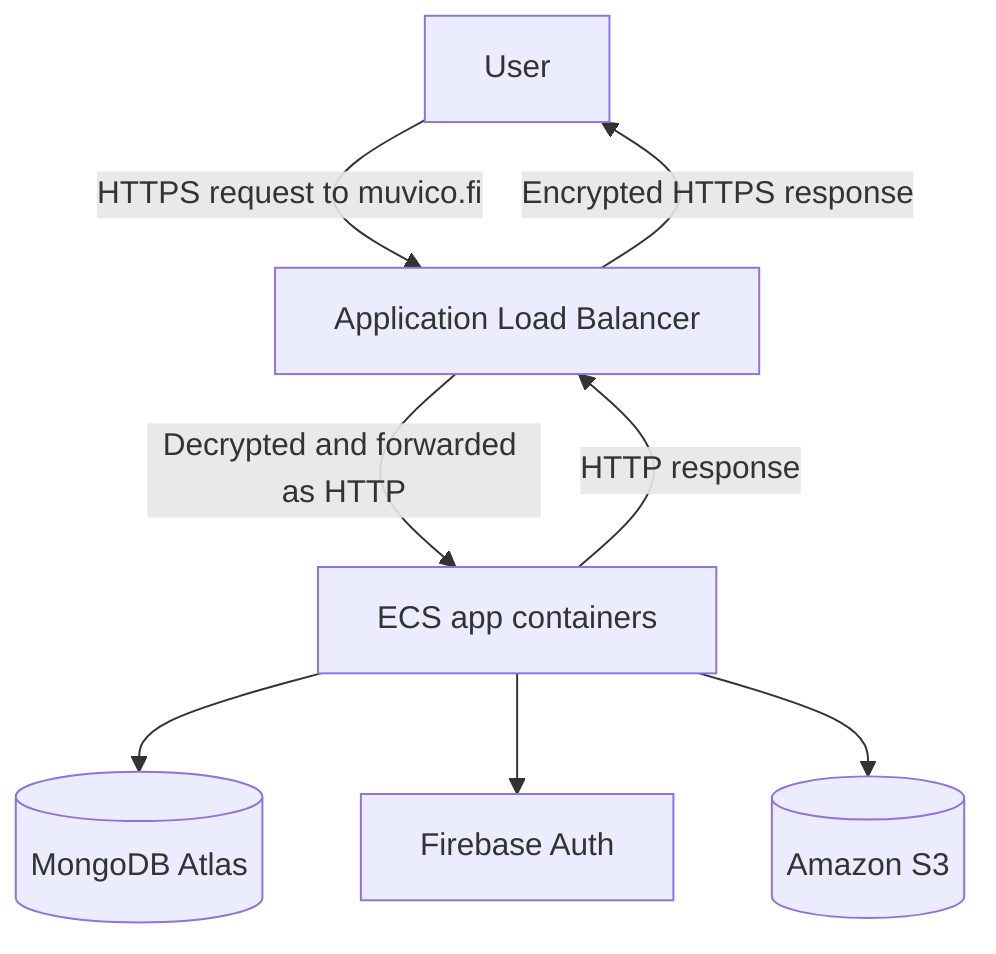

# #309: Solution for implementing HTTPS connection via AWS

## Technical context and motivation

MuViCo is a full-stack web application built with React (frontend) and Node.js + Express (backend), deployed on [Amazon ECS](https://aws.amazon.com/ecs/). The backend uses [MongoDB Atlas](https://www.mongodb.com/atlas) as the primary database and integrates with [Firebase](https://firebase.google.com/) for user authentication (Google login and token verification). Media files uploaded by users are stored in [Amazon S3](https://aws.amazon.com/s3/).

The backend exposes a REST API over HTTP, handling user authentication, presentation metadata, media uploads, and presentation updates. Because these operations handle sensitive user data (such as login credentials), cookies, and media content, enabling HTTPS is important for secure application usage.

---

## Current AWS setup and cost breakdown

MuViCo is deployed on AWS ECS containers and currently accessed via an unsecured HTTP connection using a public IP address:  
[http://16.16.127.119:8000](http://16.16.127.119:8000)

The following AWS services are used:
- [Amazon ECS (Elastic Container Service)](https://aws.amazon.com/ecs/): Runs the containerized MuViCo application
- [Amazon ECR (Elastic Container Registry)](https://aws.amazon.com/ecr/): Stores container images built from the app’s source code
- [AWS Secrets Manager](https://aws.amazon.com/secrets-manager/): Manages environment variables such as API keys and database URIs
- [Amazon S3 (Simple Storage Service)](https://aws.amazon.com/s3/): Stores presentation media and static files accessed by users
- [Amazon VPC (Virtual Private Cloud)](https://aws.amazon.com/vpc/): Provides the public IPv4 address used to expose MuViCo containers directly to the internet
- [Amazon NLB (Network Load Balancer)](https://aws.amazon.com/elasticloadbalancing/network-load-balancer/): Currently configured for basic traffic routing to ECS. NLBs are optimized for performance and can handle millions of requests per second, but they do not support SSL termination, which is required for HTTPS.

| Service                       | Monthly Cost (USD) |
|-------------------------------|--------------------|
| Public IPv4 addresses         | $11.16         |
| ECR storage                   | $0.30              |
| Secrets Manager               | $0.40              |
| Amazon S3                     | $0.00              |
| Data transfer                 | $0.01              |
| ECS, EC2, NLB (free tier)     | $0.00              |
| **Total cost**                | **~$11.87/month**  |

These costs are based on January 2025 AWS billing data. The largest cost comes from public IPv4 usage (~$11/month). The current Network Load Balancer (NLB) falls under the AWS free tier and does not currently incur charges.

---

## HTTPS setup using AWS services

To enable secure HTTPS access, the recommended approach would involve using AWS-native services that integrate with the existing ECS setup and provide automatic SSL management.

Proposed AWS services to be added:
- [Amazon ALB (Application Load Balancer)](https://aws.amazon.com/elasticloadbalancing/application-load-balancer/): Handles HTTPS traffic and integrates directly with ECS
- [AWS Certificate Manager (ACM)](https://aws.amazon.com/certificate-manager/): Issues and renews free SSL certificates
- [Amazon Route 53](https://aws.amazon.com/route53/): Registers domain names and manages DNS routing

---

## HTTPS implementation diagram

The following diagram shows how HTTPS and backend services are structured in the deployment. The Application Load Balancer (ALB) handles secure communication with the user and forwards unencrypted traffic to the ECS containers. The application architecture itself remains unchanged.

```mermaid
flowchart TD
    A[User] -->|HTTPS request to muvico.fi| B[Application Load Balancer]
    B -->|Decrypted and forwarded as HTTP| C[ECS app containers]

    C --> D@{ shape: cyl, label: "MongoDB Atlas" }
    C --> E[Firebase Auth]
    C --> F@{ shape: cyl, label: "Amazon S3" }

    C -->|HTTP response| B
    B -->|Encrypted HTTPS response| A
```

## Process

### 1. **Buy a domain name using Route 53**
- Example domains (based on Route 53 availability and pricing at the time of writing):
  - `muvico.net` (~$14/year)
  - `muvico.fi` (~$24/year)
- A domain allows replacing the current raw IP with a user-friendly URL (e.g. `https://muvico.fi`)
- A domain is required to issue an SSL certificate  
🔗 [What is an SSL certificate? – Cloudflare](https://www.cloudflare.com/learning/ssl/what-is-an-ssl-certificate/)

### 2. **Get a free SSL certificate from ACM**
- ACM provides public SSL certificates for free
- Certificates renew automatically
- Domain ownership is verified via a Route 53 DNS record (automated if using Route 53)  
🔗 [AWS Certificate Manager DNS validation](https://docs.aws.amazon.com/acm/latest/userguide/dns-validation.html)

### 3. **Deploy an Application Load Balancer (ALB)**  
- Listens for HTTPS traffic on port 443  
- Can redirect HTTP (port 80) to HTTPS automatically  
- Terminates the SSL connection and forwards traffic to ECS

### 4. **Connect ECS service to the ALB**  
- ECS containers are registered with the ALB  
- ALB performs traffic routing and health checks

### 5. **Update DNS records in Route 53**  
- Point the domain name to the ALB using an alias record  
- Users can access the app via the custom domain (e.g. `https://muvico.fi`)

### 6. **Update application settings**  
- Replace hardcoded HTTP endpoints in frontend/backend configs (e.g. `target: "http://localhost:8000" → "https://muvico.fi"`)
- Ensure secure cookies, redirects, and API base URLs are updated

### 7. **Test the deployment**  
- Confirm HTTPS is working  
- Check that HTTP redirects correctly to HTTPS

---

## Monthly cost estimate comparison

| Service                        | Current (USD) | With HTTPS (USD)     |
|-------------------------------|----------------|----------------------|
| Public IPv4 addresses         | $11.16         | ~$0–2 (reduced)      |
| Application Load Balancer     | None           | ~$18             |
| Domain (Route 53)             | None           | ~$1–2                |
| SSL Certificate (ACM)         | None           | Free                 |
| ECR, Secrets Manager, S3, etc.| ~$0.71         | ~$0.71 (unchanged)   |
| **Total monthly cost**        | **~$11.87**    | **~$20–23**          |

> These values are estimates based on January 2025 billing data. Actual costs may vary depending on traffic, uptime, and AWS region.

> ⚠️ **Note on current Network Load Balancer (NLB):**  
> MuViCo currently uses an NLB, which is covered by the AWS Free Tier. The Free Tier includes:
> - 750 hours/month shared between Classic and Application Load Balancers  
> - 15 GB of data processing for Classic Load Balancers  
> - 15 LCUs for Application Load Balancers  
> This free usage only applies during the first 12 months after AWS account creation and is subject to usage limits. After that, standard pricing will apply.
🔗 [AWS Free Tier – Elastic Load Balancing](https://aws.amazon.com/elasticloadbalancing/pricing/)

---

## Cost calculation details

The ALB estimate is based on:
- 744 hours of uptime (equivalent to one full month of continuous usage), taken directly from January’s usage data with the current Network Load Balancer
- AWS pricing calculator estimate: $17.81/month for one ALB instance with 744 hours usage

Route 53 domain registration:
- `muvico.net`: ~$1.17/month (annual cost $14)
- `muvico.fi`: ~$2/month (annual cost $24)

These additions would eliminate or at least reduce the current $11/month IPv4 address cost.

---

## Summary

| Benefit                  | Outcome                                                             |
|--------------------------|----------------------------------------------------------------------|
| HTTPS via ACM            | Secure, encrypted connections with automatic certificate renewal    |
| Custom domain            | Improved user experience: more memorable, trusted, and professional web address       |
| ALB integration          | Native support for HTTPS, ECS health checks, and routing            |
| Reduced IPv4 usage and costs    | Replaces public IP with domain routing -> cost savings offset a part of new expenses |
| Simpler DNS + SSL config | Using Route 53 simplifies domain linking and certificate verification |

This approach adds HTTPS to MuViCo in a way that allows for smooth integration with the current ECS deployment.
