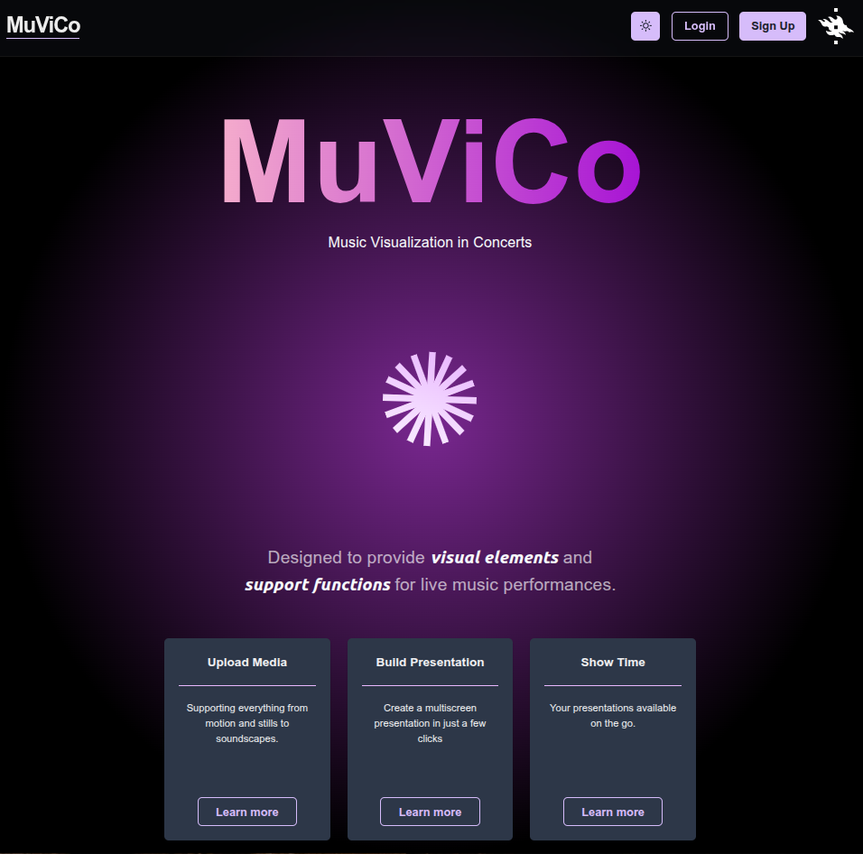
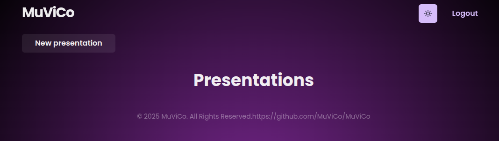
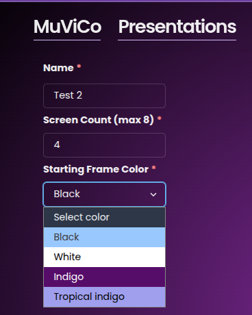
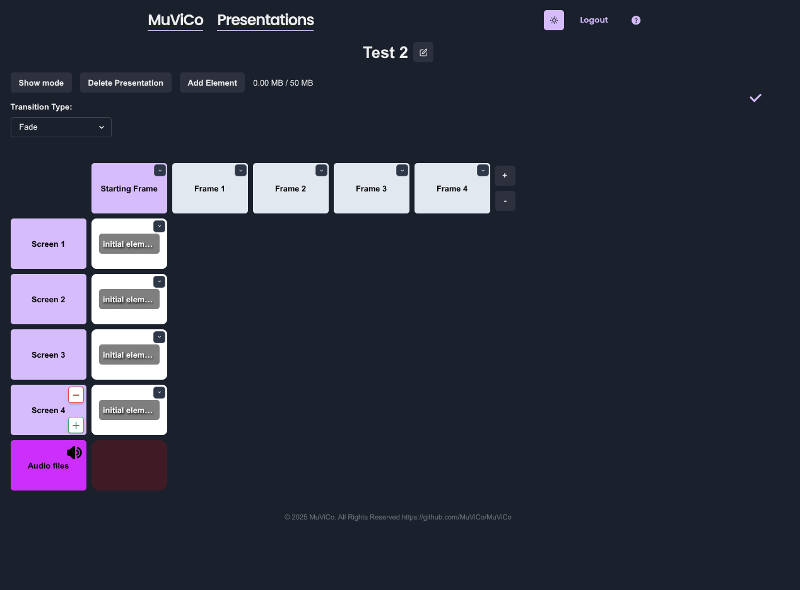
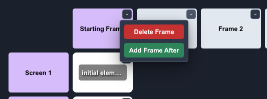
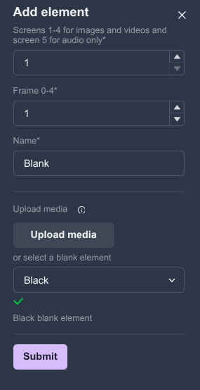
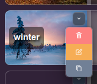
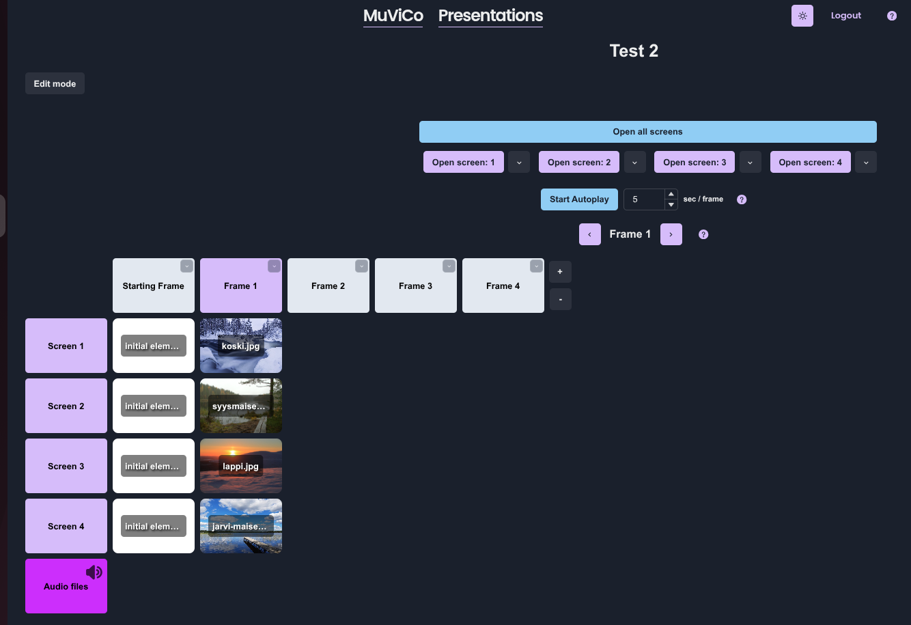
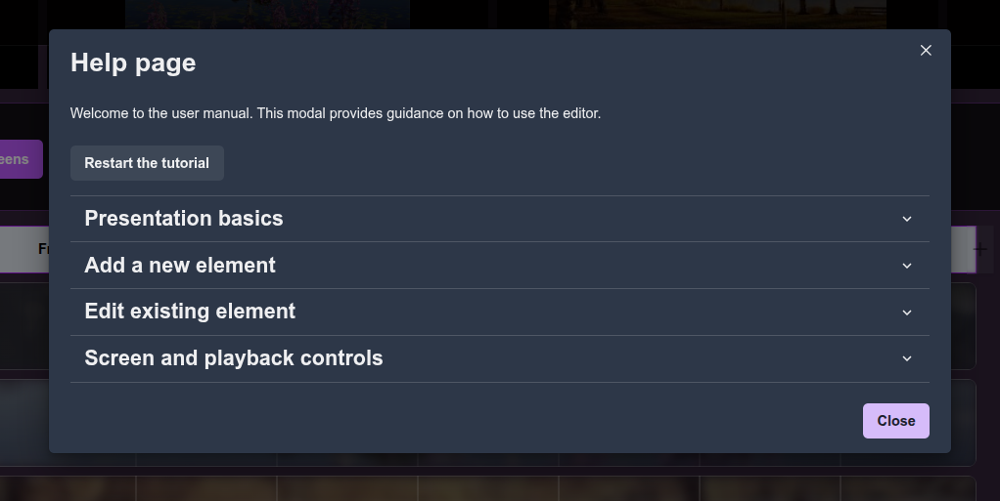

# User guide

## Instructions for using the application

Website URL: https://muvico.live/

## Front page

When you open MuViCo, the first thing you will see is the front page:

### Features on this page:

- **Login button**: Click to sign in if you already have an account.
- **Sign Up button**: Click to create a new account if you are using the app for the first time.
- **Theme button (🌙/☀️ button)**: Adjust the theme between light and dark modes.

You can learn more about the key features **(Ease of use, Multiple screens, and Remote access)** of the application by clicking the **"Learn more"** buttons at the bottom of the page.

By scrolling down, you can also access the MuViCo introduction videos and learn how it is used, all without needing to log in.

## Home page

After signing in, you will be taken to the **home page** , where you can access your existing presentations, modify them, and create new ones with ease.

### Features on this Page:

- **New presentation button**: Click this to create a new presentation.
- **Logout button**: Click this to log out of your account.
- **MuViCo button**: Click this to go to the front page.
- **Trash can button**: Click this to delete the presentation.

When you click the New presentation button, you first need to enter a name for your presentation and choose the number of screens to start with (you can add or delete screens later while editing so don't worry about this too much here). You will also select a color for the Starting Frame.

## Edit presentation page

After that, your new presentation will open in edit mode. You can also find it on your home page alongside your other presentations, and clicking it there will take you back to the edit page. In edit mode, you can adjust your presentation to fit your live show perfectly by adding new elements, editing existing ones, and adding new frames or screens.

### Features on this page:

- **Navigation bar (top menu)**

  - **Show Mode**: Preview your presentation.
  - **Delete Presentation**: Delete the current presentation.
  - **Add Element**: Insert new elements into your presentation.
  - **Storage indicator**: Displays how much space has been used (e.g., 0.00 MB / 50 MB). The maximum allowed space is 50 MB.
  - **Save status icon** (✔️): This is marked when your changes have been successfully saved.
  - **Pencil icon**: Next to the name of your presentation, you’ll see a pencil icon. Click it to easily rename your presentation.
  - **Transition type**: Here you can choose a transition type, which is the visual effect that appears when you move from one frame to the next in show mode

- **Frames section (top row with white boxes labeled Starting Frame, Frame 1, Frame 2, etc.)**

  - This shows the order in which your elements will be displayed on the selected screen.
  - Initially starts with 1 starting frame and 4 extra frames.
  - Additional frames can be added or removed by clicking the +/- buttons.
  - You can have anywhere from 1 to 100 frames per screen.
  - You can also add or delete frames between existing ones by clicking the dropdown button on the frame you want to modify.

  

- **Screens section (left side with purple boxes labeled Screen 1, Screen 2, etc. and Audio files)**

  - Displays all the screens you can use for your presentation.
  - You can use multiple screens in your presentation.
  - Additional screens can be added or removed by clicking the +/- buttons.
  - The "Audio files" row is used only for audio files. Only audio files can be uploaded on this row.
  - Audio files have a few extra features:
    - Loop button: click on the loop button on an audio element to have the audio tape play continuously in your presentation.
    - Speaker icon: click on the Audio files box's speaker icon to mute the audio in your presentation.

- **Initial elements (elements labeled as initial elements)**
  - When creating a new presentation, initial elements are added to all screens at the starting frame.
  - You can delete elements by opening the dropdown menu and clicking the trash can icon. You can modify them by either double-clicking the element or selecting the pencil icon from the dropdown menu.

## Adding an element

You can add an element in different ways:

- Click the **"Add Element"** button to open the element creation panel.
- **Double-click** anywhere on the screen to open the panel. This will automatically set the screen and frame based on where you clicked.
- **Drag and drop** a file directly to the screen.
- You can copy an existing element by clicking its **copy button** from the dropdown menu, and then click on desired positions to paste it.

### Steps to add an element

1. **Open the "Add Element" panel** by double-clicking a wanted frame or clicking the Add element button

2. **Select the screen**

   - Choose a screen from 1 up to 8 where the new image or video element will be placed.
   - Choose the highest screen number for audio elements.

3. **Select the frame**

   - The frame determines the element's position on the selected screen.
   - The default frame will be the first available frame on the selected screen.
   - You can choose any frame between 0 up to the highest in your project (max 100).

4. **Name the new element**

   - The element is automatically given the same name as the file on your local machine.
   - You can also edit the name and enter a descriptive name for the element to easily identify it later.

5. **Upload media or select "Add blank"**:

   - Click **"Upload media"** to add an image or video.
   - The information button (ℹ️) will show you the **allowed file types**:
     - **Images:** .png, .bmp, .jpeg, .jpg, .jpe, .jfif, .gif, .cur, and .ico
     - **Videos:** .mp4, .webm, and ogg
     - **Audio:** .mp3 and .wav
   - If you don't upload anything the default is Black element with name "Blank" which you are able to add without making any changes to the Add elem. You can also choose another color from the dropdown list provided.

6. **Submit the Element**
   - Click **"Submit"** to confirm the addition of your new element to the screen.

**If you only want to add a blank element**, you can simply click Submit without making any changes to the form (assuming the screen and frame are the ones you want). A blank element is black by default, but you can change its colour from the provided list.

## Editing an existing element

You can modify an element in different ways:

- Click the **"Add element"** button and select the screen (min 1, up to 8) or audio (highest screen number) and frame (min 0 (Starting Frame), up to highest frame number) of the element you want to change.
- **Drag and drop** a new file on top of the existing element to replace it.
- **Double-click** on the element
- **Drag and drop** the element to insert it into a new position. If there is already an element in that position, the two elements will swap places.
- All elements have their own **dropdown menu**, which includes:
  - **Delete button**: The trash can icon allows you to easily delete the selected element.
  - **Edit button**: The pencil icon opens the Edit Element form, where you can, for example, change the frame of that specific element.
  - **Copy button**: The copy icon lets you copy the element. Click another spot to place the copy. You can continue copying as long as you like; copying ends when you click outside the grid.
  

## Show mode page

When you click on the **"Show mode"** button on the **edit presentation** page you will be directed to the show mode page which allows you to view and showcase your presentation in real-time. Here you can open your screens and manually navigate between frames. I added couple pictures to make the presentation more lively.

### Features on this page:

- **Edit Mode button (top left)**: Go back to the editing page.

- **Screen selection (purple buttons on the top labeled Open screen 1, Open screen 2, etc.)**

  - You can display a specific screen by clicking the **"Open screen"** button
  - Above the individual Open Screen buttons, there is also an Open All Screens button, which lets you open all screens at once.
  - You can open and close screens using the same buttons. When a screen is open, the button changes to “Close Screen.” The Open All Screens button works the same way — once all screens are open, it changes to “Close All Screens".
  Mirroring:
    - Next to the individual **"Open screen"** button is an arrow that opens a dropdown menu.
      - There you can choose to mirror another screen's elements.
      - This is done to ensure that if during a presentation a monitor were to crash it is possible to show these elements on another screen.
  - Note that the audio row cannot be opened. Audio in the presentation will start playing on its index on the speaker that has been selected as the output device in the computer that the presentation is controlled on.

- **Autoplay**
  - Autoplay allows you to automatically progress through the frames at a set interval.
  - Each frame is displayed for the number of seconds you enter in the box. You can also choose a time which is less than a second.
  - Open the wanted screens and click “Start Autoplay” to begin playing the frames automatically. Autoplay always starts from the Starting Frame.
  - You can also switch the frames manually and change the sec/frame during the Autoplay.
  - Autoplay stops automatically after the last frame.
  - You can also stop it manually at anytime by clicking “Stop Autoplay.”

- **Frame navigation (below autoplay section)**
  - **Frame display (e.g., "Starting Frame", "Frame 1", etc)**: Shows the current index being played, you can also see the current frame highlighted with a light purple colour
  - **Left ("<") and right (">") arrows**: Navigate between frames to control the presentation flow manually.

- **Still in need of help?**
  - There is a question mark button in every page on the top left corner

  

  - It opens a window that provides the most helpful guidance for the specific page you are on when you click the button.
  - There are also guided tutorials on the presentation page and the editing page when you visit MuViCo.live for the first time. The tutorial walks you through the app and teaches you all the features of MuViCo. You can also rewatch it anytime by clicking “Restart the tutorial.”
  - Inside the subsections, you can find detailed instructions to help ensure your MuViCo experience is smooth and enjoyable.

  

  ENJOY!
