# User guide

## Instructions for using the application

Website URL: https://muvico.live/

## Front page

When you open MuViCo, the first thing you will see is the front page:

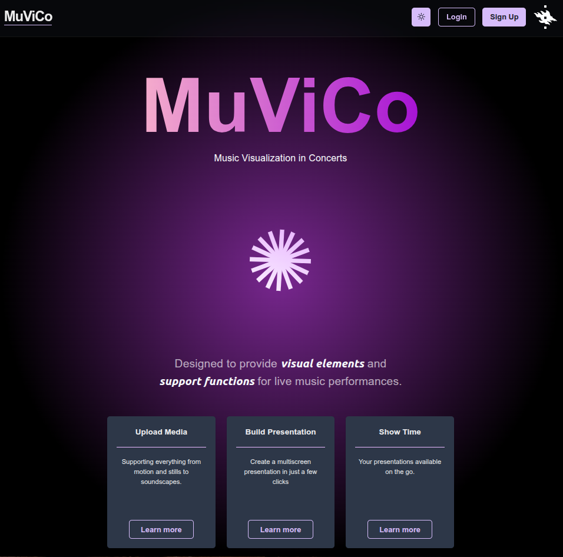

### Features on this page:

- **Login button**: Sign in if you already have an account.
- **Sign Up button**: Create a new account if you are using the app for the first time.
- **Theme button (🌙/☀️ button)**: Switch between light and dark modes.
- **University of Helsinki logo**
- **Footer**: View the version, Terms, Privacy & Cookies and GitHub.

You can learn more about the key features **(Upload Media, Build Presentation, and Show Time)** of the application by clicking the **"Learn more"** buttons at the bottom of the page.

By scrolling down, you can also access the MuViCo introduction video and learn how to use the application without logging in.

## Home page

After signing in, you will be taken to the **home page** , where you can access your existing presentations, modify them, and create new ones.

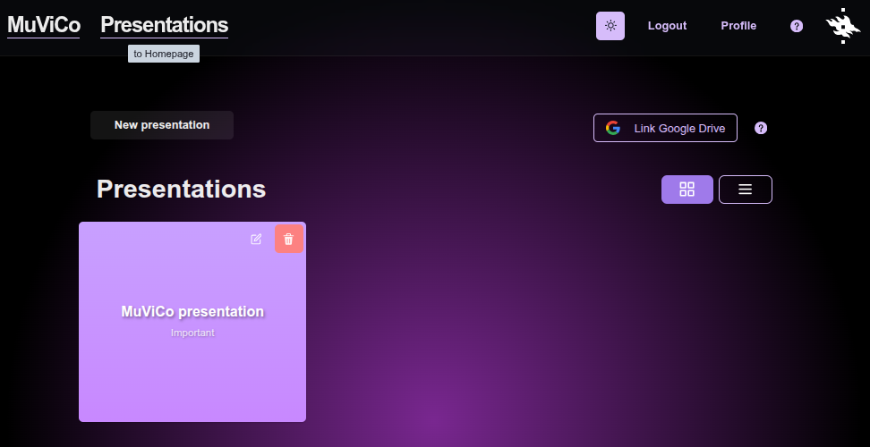

### Features on this page:

Navbar:
- **MuViCo button**:Go to the front page.
- **Logout button**: Log out of your account.
- **Profile button**: Go to the profile page.
- **Help page**: Open the help page.

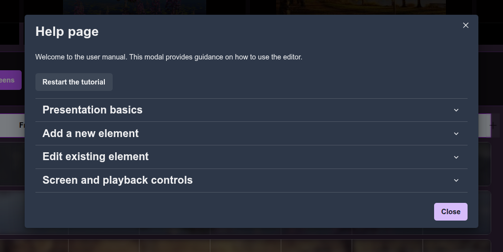

Other:
- **New presentation button**: Create a new presentation.
- **Edit button**: Edit presentation's name or description.
- **Trash can button**: Delete the presentation.
- **Presentation View Options**: Change how presentations are displayed.

When you click the 'New presentation' button, you can name the presentation, optionally add a description, and choose the number of screens. The maximum number of screens is 8.

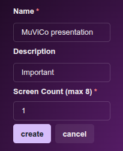

## Editor page

After creating a new presentation or selecting an existing one, you will be taken to the editor.

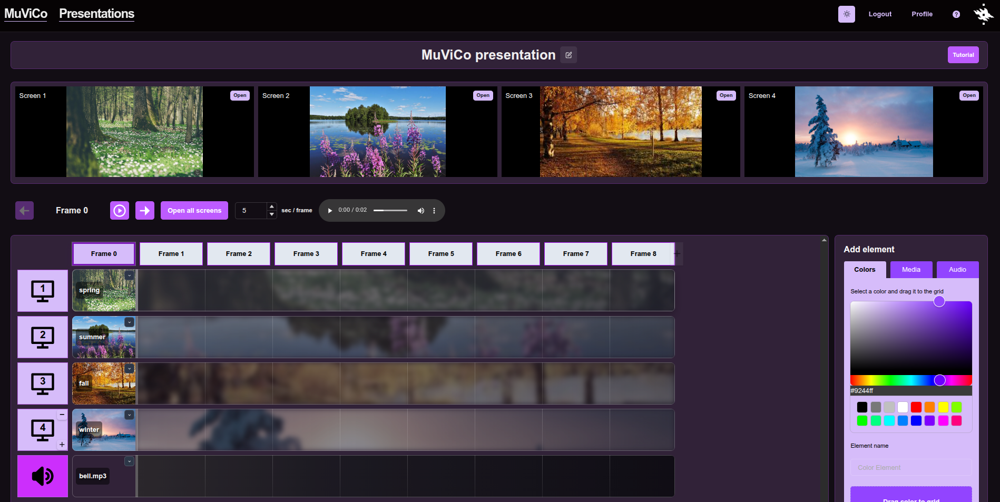

At the top, you can see the name of the presentation. Below it is a preview of the screens you selected. Under the preview are the editor controls. Below those is the editor itself. On the right side of the editor, there is a panel for adding elements to the presentation.

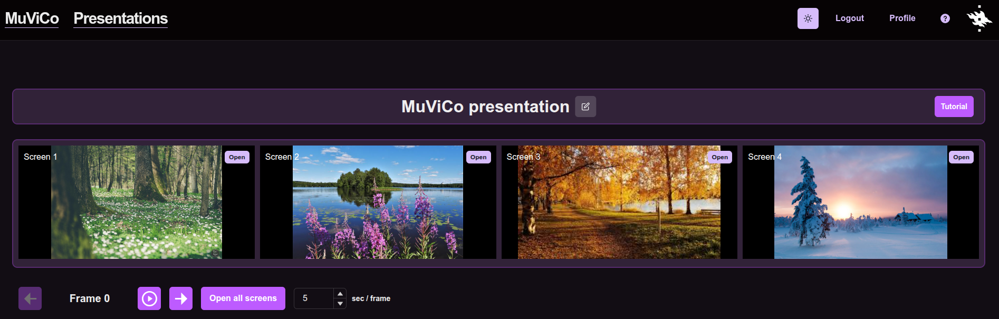

### Features on this page:

- **Edit presentation button**:
  - Rename the presentation title.
  - Save or cancel the changes.

- **Tutorial**: Open the help page.
 
- **Open one screen**:
  - Click 'Open' on a screen to view it in the current frame.

- **Open all screens**:
  - Click 'Open all screens' to view all screens in the current frame simultaneously.
 
- **Frame navigation arrows**:
  - Use the 'Previous' and 'Next' arrow buttons to move between frames.
  - The current frames can be seen in the screen preview area.

- **Autoplay**:
  - Each frame is shown for the sec/frame value.
  - By default, autoplay starts from the starting frame.
  - To start from another frame, click that frame first.
  - Autoplay stops at the last frame, or you can stop it any time with 'Stop Autoplay'.

- **Audioplayer**: Play a audiofile.

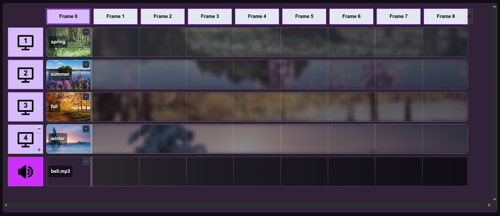

- **Edit frame count**:
  - Add a frame: Click the '+' button to add a new frame.
  - Remove a frame: Click the 'x' button above the frame to remove it.

- **Edit screen count**:
  - Add a screen: Click the '+' button on the last screen header to add a new screen.
  - Remove a screen: Click the '-' button on the screen header to remove a screen.

- **Keyboard shortcuts**:
  - Next index: → ArrowRight, ↑ ArrowUp, PageDown
  - Previous index: ← ArrowLeft, ↓ ArrowDown, PageUp

## Add a new element

**You can add different types of elements**:

**Color**: Choose a color element using the color picker or palette. Optionally, give the selected color a name.

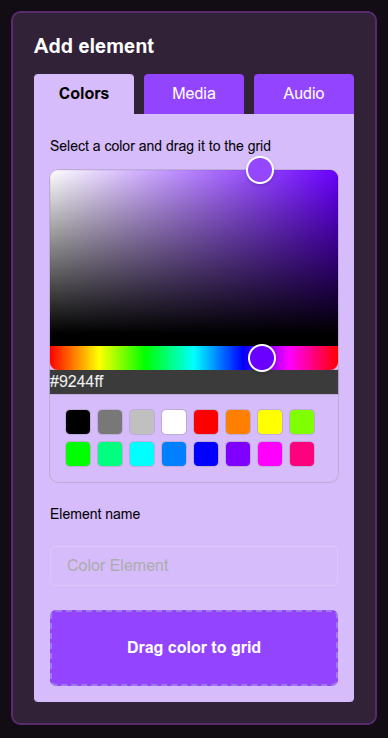 

**Media**: Upload an image or video.

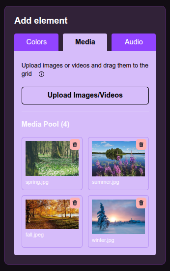 

**Audio**: Upload an audio file.

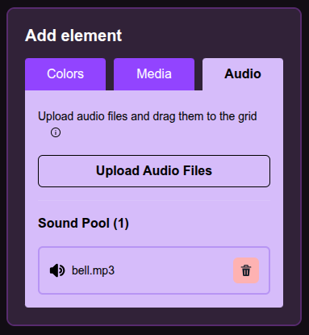

**Place the element in the editor**:
- Drag and drop the element into the frame where you want to place it.

## Edit existing element

You can edit element names by double-clicking them.

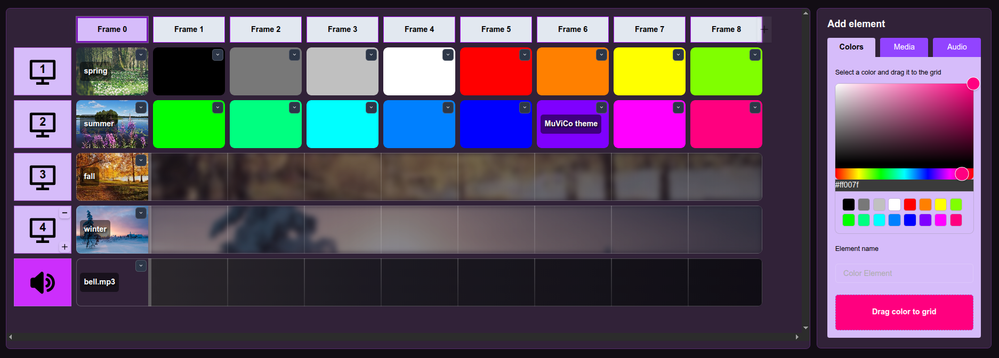

or

- **Choose the element to edit**:
  - Click the top-right corner of the element to open the dropdown menu.
- **Delete**:
  - Remove the element from the presentation.
- **Edit**:
  - Change the element name or add one.
  - You can also rename an element by double-clicking it.
- **Copy**:
  - Create a duplicate of the element.
  - Place the duplicate in a different frame by clicking the target location.
  - Exit copy mode by clicking outside the grid.

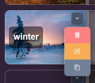

## Profile page

Navigate to the profile page from the navigation bar.

### Features on this page:

- **Account information**: View you username.
- **Change password**: Enter your current password and set a new one. Confirm the changes or return to the front page.

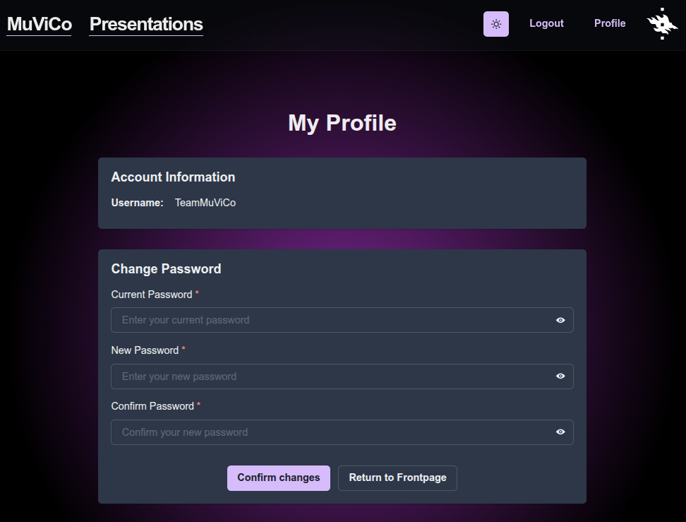

# ENJOY using MuViCo !
