# User guide

## Instructions for using the application

Website URL: https://muvico.live/

## Front page

When you open MuViCo, the first thing you will see is the front page:

### Features on this page:

- **Login button**: Sign in if you already have an account, either with your username and password or with the **Sign in with Google** button.
- **Sign Up button**: Create a new account if you are using the app for the first time.
- **Theme button (🌙/☀️ button)**: Switch between light and dark modes.
- **University of Helsinki logo**
- **Footer**: View the version, Terms, Privacy & Cookies and GitHub.

You can learn more about the key features **(Upload Media, Build Presentation, and Show Time)** of the application by clicking the **"Learn more"** buttons at the bottom of the page.

By scrolling down, you can also access the MuViCo introduction video and learn how to use the application without logging in.

## Home page

After signing in, you will be taken to the **home page** , where you can access your existing presentations, modify them, and create new ones.

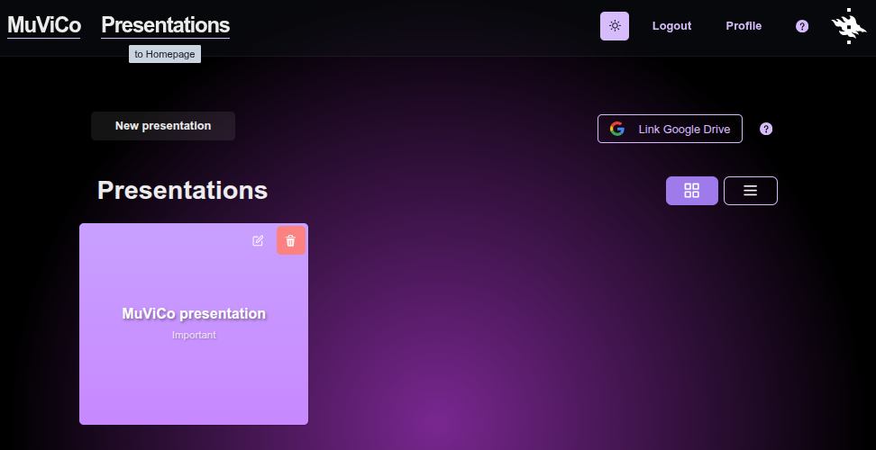

### Features on this page:

Navbar:

- **MuViCo button**:Go to the front page.
- **Logout button**: Log out of your account.
- **Profile button**: Go to the profile page.
- **Help page**: Open the help page.

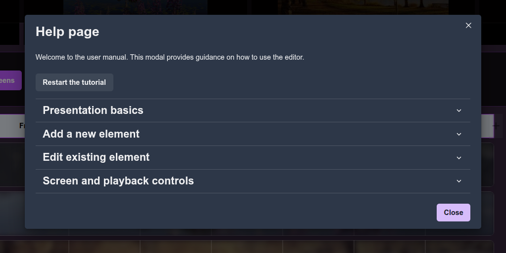

Other:

- **New presentation button**: Create a new presentation.
- **Edit button**: Edit presentation's name or description.
- **Trash can button**: Delete the presentation.
- **Presentation View Options**: Change how presentations are displayed.

When you click the 'New presentation' button, you can name the presentation, optionally add a description, and choose the number of screens. The maximum number of screens is 8.

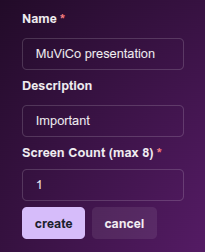

## Editor page

After creating a new presentation or selecting an existing one, you will be taken to the editor.

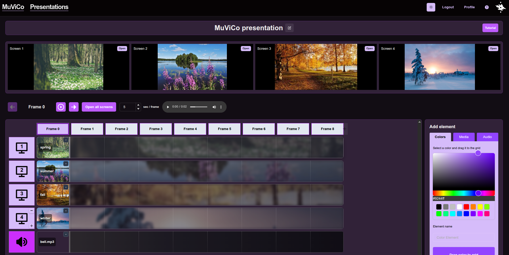

At the top, you can see the name of the presentation. Below it is a preview of the screens you selected. Under the preview are the editor controls. Below those is the editor itself. On the right side of the editor, there is a panel for adding elements to the presentation.

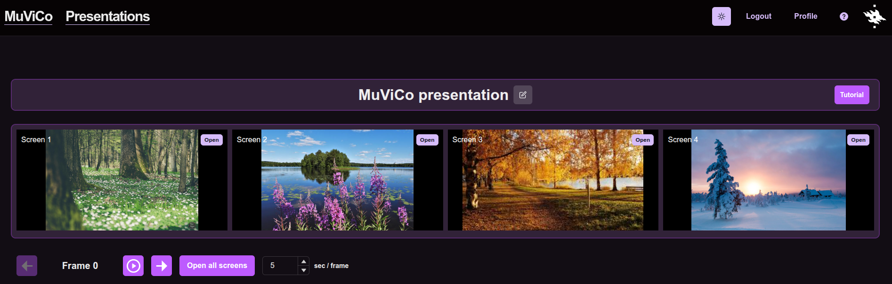

### Features on this page:

- **Edit presentation button**:

  - Rename the presentation title.
  - Save or cancel the changes.

- **Tutorial**: Open the help page.

- **Open one screen**:

  - Click 'Open' on a screen to view it in the current frame.

- **Open all screens**:

  - Click 'Open all screens' to view all screens in the current frame simultaneously.

- **Frame navigation arrows**:

  - Use the 'Previous' and 'Next' arrow buttons to move between frames.
  - The current frames can be seen in the screen preview area.

- **Autoplay**:

  - Each frame is shown for the sec/frame value.
  - By default, autoplay starts from the starting frame.
  - To start from another frame, click that frame first.
  - Autoplay stops at the last frame, or you can stop it any time with 'Stop Autoplay'.

- **Audioplayer**: Play a audiofile.

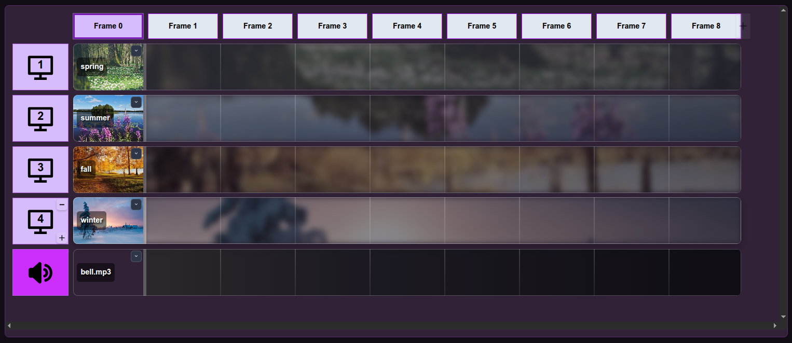

- **Edit frame count**:

  - Add a frame: Click the '+' button to add a new frame.
  - Insert a frame before another: Hover over a frame's header — a '+' appears on its left edge — and click it to insert a new frame right before that one.
  - Remove a frame: Click the 'x' button above the frame to remove it.

- **Edit screen count**:

  - Add a screen: Click the '+' button on the last screen header to add a new screen.
  - Remove a screen: Click the '-' button on the screen header to remove a screen.

- **Keyboard shortcuts**:
  - Next index: → ArrowRight, ↑ ArrowUp, PageDown
  - Previous index: ← ArrowLeft, ↓ ArrowDown, PageUp

## Add a new element

**You can add different types of elements**:

**Color**: Choose a color element using the color picker or palette. Optionally, give the selected color a name.

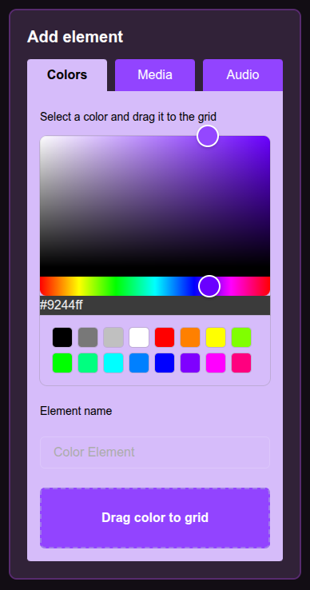

**Media**: Upload an image or video.

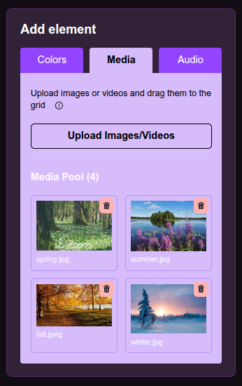

**Audio**: Upload an audio file.

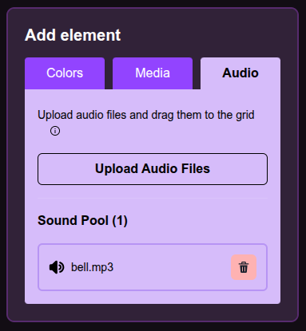

**Place the element in the editor**:

- Drag and drop the element into the frame where you want to place it.

## Edit existing element

You can edit element names by double-clicking them.

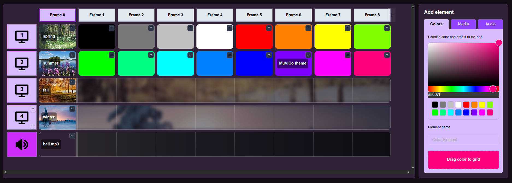

or

- **Choose the element to edit**:
  - Click the top-right corner of the element to open the dropdown menu.
- **Delete**:
  - Remove the element from the presentation.
- **Edit**:
  - Change the element name or add one.
  - You can also rename an element by double-clicking it.
- **Copy**:
  - Create a duplicate of the element.
  - Place the duplicate in a different frame by clicking the target location.
  - Exit copy mode by clicking outside the grid.
- **Span across multiple screens** (image elements only):
  - Click "Span across multiple screens" in the element's menu.
  - Pick the additional screens the image should spread across, left to right. The screen the image was originally placed on stays included.
  - The image keeps one consistent scale and vertical framing across every screen it spans, so it reads as a single continuous picture rather than a re-scaled copy per screen.

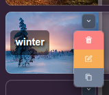

## Scores

The Scores tab in the editor's side panel lets you attach a PDF score to the presentation and mark where, in the score, the presentation should advance to the next frame.

- **Add a score**: Upload a PDF directly, or import one from an IMSLP URL.
- **Browse the score**: Turn pages, zoom, and expand the viewer, same as any PDF.
- **Add a marker**: Click "Marker" to arm placement mode, then click anywhere on the score to place a marker there. Pick the frame it should correspond to, and confirm.
- **Edit or remove a marker**: Click an existing marker (the small numbered pin) to reopen its frame selection, change the frame, or delete it.
- **Jump to a marker**: The "Markers" bar below the score lists every marker across every page of the score. Click one to jump straight to its page, with the marker briefly highlighted.

Markers are purely informational — they don't automatically advance the presentation. They're there so a performer can see, at a glance while reading their score, which frame the show should be on at that point.

## Profile page

Navigate to the profile page from the navigation bar.

### Features on this page:

- **Account information**: View you username.
- **Change password**: Enter your current password and set a new one. Confirm the changes or return to the front page.

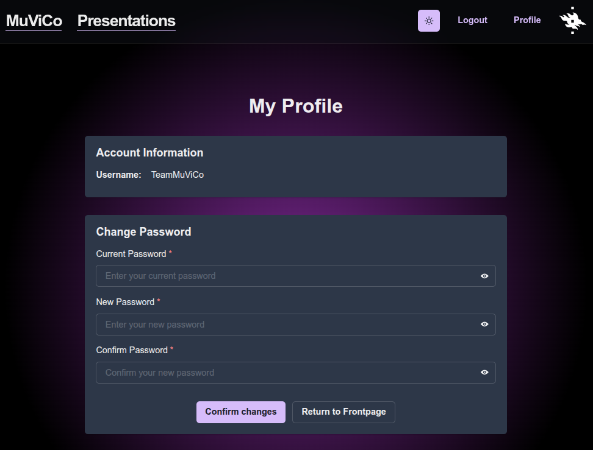

# ENJOY using MuViCo !
