# User guide

## Instructions for using the application

Website URL: https://muvico.live/

## Front page

When you open MuViCo, the first thing you will see is the front page:

### Features on this page:

- **Login button**: Sign in if you already have an account, either with your username and password or with the **Sign in with Google** button.
- **Sign Up button**: Create a new account if you are using the app for the first time.
- **Theme button (🌙/☀️ button)**: Switch between light and dark modes.
- **University of Helsinki logo**
- **Footer**: View the version, Terms, Privacy & Cookies and GitHub.

You can learn more about the key features **(Upload Media, Build Presentation, and Show Time)** of the application by clicking the **"Learn more"** buttons at the bottom of the page.

By scrolling down, you can also access the MuViCo introduction video and learn how to use the application without logging in.

## Home page

After signing in, you will be taken to the **home page** , where you can access your existing presentations, modify them, and create new ones.

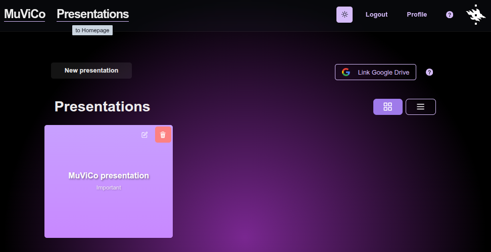

### Features on this page:

Navbar:

- **MuViCo button**:Go to the front page.
- **Logout button**: Log out of your account.
- **Profile button**: Go to the profile page.
- **Help page**: Open the help page.

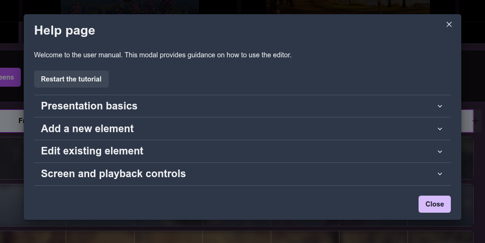

Other:

- **New presentation button**: Create a new presentation.
- **Edit button**: Edit presentation's name or description.
- **Trash can button**: Delete the presentation.
- **Presentation View Options**: Change how presentations are displayed.

When you click the 'New presentation' button, you can name the presentation, optionally add a description, and choose the number of screens. The maximum number of screens is 8.

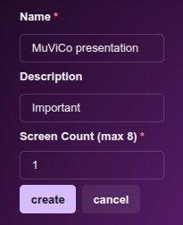

## Editor page

After creating a new presentation or selecting an existing one, you will be taken to the editor.

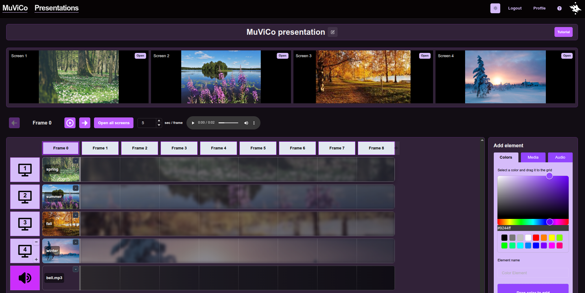

At the top, you can see the name of the presentation. Below it is a preview of the screens you selected. Under the preview are the editor controls. Below those is the editor itself. On the right side of the editor, there is a panel for adding elements to the presentation.

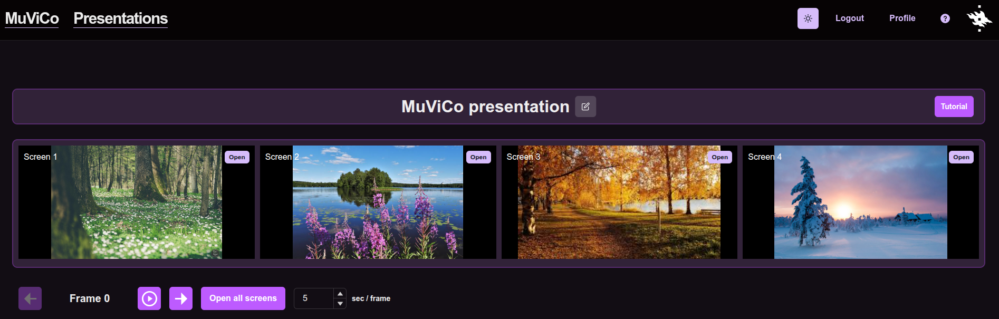

### Features on this page:

- **Edit presentation button**:

  - Rename the presentation title.
  - Save or cancel the changes.

- **Presentation Settings** (gear icon):

  - **Transition Type**: Choose how the display changes from one frame to the next during the show — Fade, Slide From Left, Slide From Right, Zoom, or None. This applies to the whole presentation.
  - **Output shape, all screens**: Choose the aspect ratio every screen uses — 16:9 (widescreen), 16:10, 4:3, 21:9 (ultrawide), or 1:1 (square). Each screen's preview also has its own small shape selector in its bottom-right corner, letting you override this global shape for just that one screen.

- **Share**: Open the "Share this presentation" dialog to create a read-only link. Anyone with the link can view the presentation while logged in to MuViCo, but cannot edit it. Click "Stop sharing" to revoke the link; a new link can be created afterwards. If the presentation uses media from your Google Drive, creating the link copies that media into MuViCo's own storage so viewers can see it without needing access to your Drive — if your Google account isn't connected, you'll be asked to reconnect it first.

- **Tutorial**: Open the help page.

- **Open one screen**:

  - Click 'Open' on a screen to view it in the current frame.

- **Open all screens**:

  - Click 'Open all screens' to view all screens in the current frame simultaneously.

- **Frame navigation arrows**:

  - Use the 'Previous' and 'Next' arrow buttons to move between frames.
  - The current frames can be seen in the screen preview area.

- **Autoplay**:

  - Each frame is shown for the sec/frame value.
  - By default, autoplay starts from the starting frame.
  - To start from another frame, click that frame first.
  - Autoplay stops at the last frame, or you can stop it any time with 'Stop Autoplay'.

- **Audioplayer**: Play a audiofile.

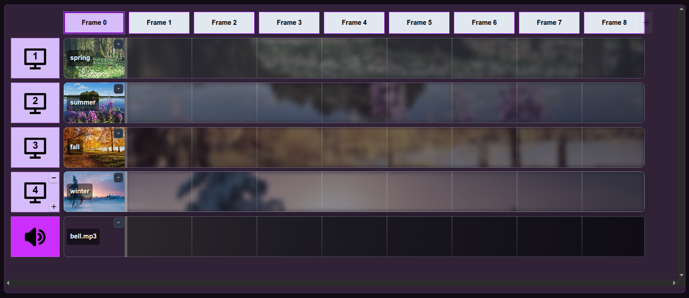

- **Edit frame count**:

  - Add a frame: Click the '+' button to add a new frame.
  - Insert a frame before another: Hover over a frame's header — a '+' appears on its left edge — and click it to insert a new frame right before that one.
  - Remove a frame: Click the 'x' button above the frame to remove it.
  - Rename a frame: Double-click a frame's header to type a custom name (up to 60 characters). Press Enter or click away to save, Escape to cancel. Clear the name to go back to the default "Frame N" label.

- **Extend an element's duration**: Hover a visual element (image, video, or text) in the grid and drag the thin handle on its right edge to make it span several frames in a row, instead of just one. Drag it back to shorten it again. It stops at whatever element already occupies the next frame in that layer.

- **Edit screen count**:

  - Add a screen: Click the '+' button on the last screen header to add a new screen.
  - Remove a screen: Click the '-' button on the screen header to remove a screen.

- **Keyboard shortcuts**:
  - Next index: → ArrowRight, ↑ ArrowUp, PageDown
  - Previous index: ← ArrowLeft, ↓ ArrowDown, PageUp
  - Toggle Autoplay: Space

## Add a new element

**You can add different types of elements**:

**Color**: Choose a color element using the color picker or palette. Optionally, give the selected color a name.

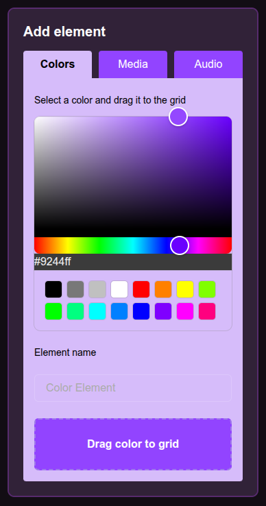

**Text**: Type a text in the Text tab, choose its size (a percentage of the screen height, so it looks the same on every screen) and its color. The text is shown centered on the screen. To put it on top of an image or a color, place it on a layer above that element. Double-click a text element to change its text, size or color.

**Media**: Upload an image or video.

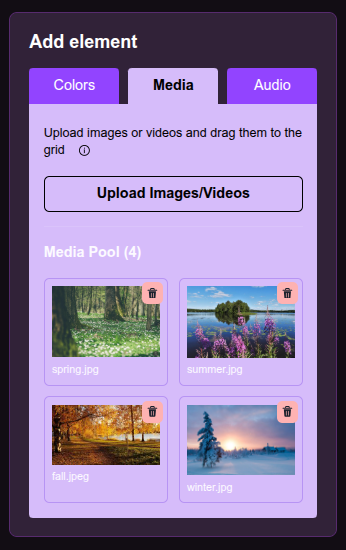

**Audio**: Upload an audio file.

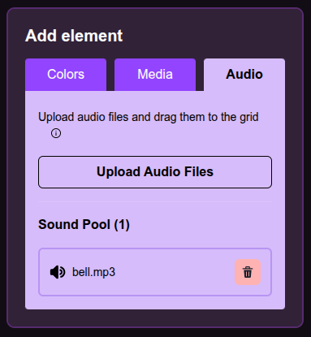

**Place the element in the editor**:

- Drag and drop the element into the frame where you want to place it.
- To insert it between two frames that already hold elements in the same layer, drop it near the left edge of the second one. A green line shows where the new frame will appear; everything from that point on shifts one frame to the right to make room.

## Edit existing element

You can edit element names by double-clicking them.

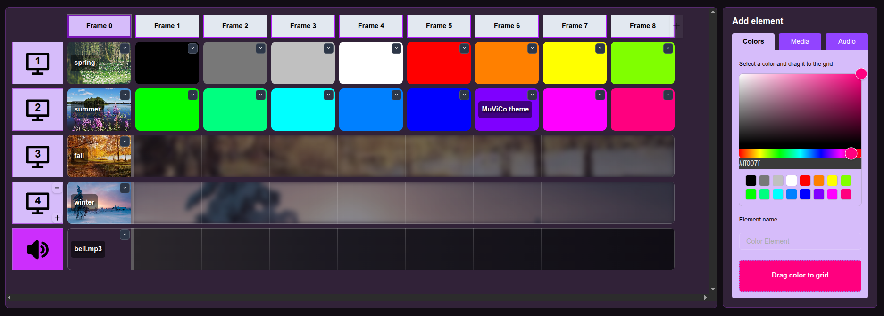

or

- **Choose the element to edit**:
  - Right-click the element to open its actions at the pointer position.
  - Alternatively, hover or focus the element and click the three-dot button in
    its top-right corner. On a keyboard, use `Shift+F10` while that button is
    focused.
- **Position and resize on screen**:
  - Click an element in a screen preview to select it (it gets a purple outline), then drag it to move it freely within that screen.
  - Drag one of the four corner handles to resize it from that corner.
  - This free-form dragging is only available for elements on a single screen. An element spanning multiple screens uses the fill/position controls described below instead.
- **Animate an element** (text and image elements):
  - Text elements: choose "Star Wars crawl", "Scroll up", or "Scroll down" from the Animation dropdown.
  - Image elements: choose "Fade in/out" from the Animation dropdown.
  - Once an animation is chosen, use the Animation speed slider (0.25× to 4×) to make it play slower or faster, and check "Repeat the animation" to have it loop continuously instead of playing once.
- **Delete**:
  - Remove the element from the presentation.
- **Edit**:
  - Change the element name or add one.
  - You can also rename an element by double-clicking it.
- **Copy**:
  - Create a duplicate of the element.
  - Place the duplicate in a different frame by clicking the target location.
  - Exit copy mode by clicking outside the grid.
- **Span across multiple screens** (image elements only):
  - Click "Span across multiple screens" in the element's menu.
  - Pick the additional screens the image should spread across, left to right. The screen the image was originally placed on stays included.
  - The image keeps one consistent scale and vertical framing across every screen it spans, so it reads as a single continuous picture rather than a re-scaled copy per screen.
  - Choose **Fill** to zoom the image up until it completely covers every screen it spans, cropping whatever overflows, or **Fit** to shrink it so the whole image stays visible (which can leave empty bands if its proportions don't match the screens).
  - Use the 3x3 grid to choose which part of the image stays anchored — for example, "Top left" keeps that corner in view when the image is cropped or doesn't fill every screen.

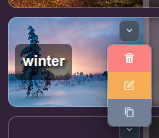

## Scores

The Scores tab in the editor's side panel lets you attach a PDF score to the presentation and mark where, in the score, the presentation should advance to the next frame.

- **Add a score**: Upload a PDF directly, or import one from an IMSLP URL.
- **Browse the score**: Turn pages, zoom, and expand the viewer, same as any PDF.
- **Add a marker**: Click "Marker" to arm placement mode, then click anywhere on the score to place a marker there. Pick the frame it should correspond to, and confirm.
- **Edit or remove a marker**: Click an existing marker (the small numbered pin) to reopen its frame selection, change the frame, or delete it.
- **Jump to a marker**: The "Markers" bar below the score lists every marker across every page of the score. Click one to jump straight to its page, with the marker briefly highlighted.

Markers are purely informational — they don't automatically advance the presentation. They're there so a performer can see, at a glance while reading their score, which frame the show should be on at that point.

## Show mode

Click **Show mode** from the editor to run the presentation in a dedicated full-screen workspace. The editor state, current frame, open display windows, audio playback, and score remain active when switching modes.

- **Music stand**: Read the score in a two-page or scrolling layout, follow the marker for the current frame, and enable automatic page turns. The side rail shows live and next screen previews, frame cues, and active audio tracks.
- **Control room**: Monitor every display, distinguish open and closed output windows, open a display directly, preview which screens will change on the next frame, and view the score in a compact panel.
- **GO and Previous**: Advance or return one frame while keeping visual and audio cues synchronized.
- **Auto**: Run frames automatically using the interval configured in the editor.
- **Audio controls**: Turn audio on/off for the whole show with "Audio on/off", and switch between "Auto" (tracks start and stop automatically as you change frames) and "Manual" (once audio is on, each active track gets its own Play/Pause button, so you start and stop them independently of frame changes). The audio strip lists every active track by name and lane.
- **Blackout**: Mask every output window without changing the current frame or stopping audio. The operator previews remain visible.
- **Monitor**: Open either the score or the complete screen wall in a separate operator window.
- **Exit**: Return to the same presentation in the editor.

## Profile page

Navigate to the profile page from the navigation bar.

### Features on this page:

- **Account information**: View you username.
- **Change password**: Enter your current password and set a new one. Confirm the changes or return to the front page.

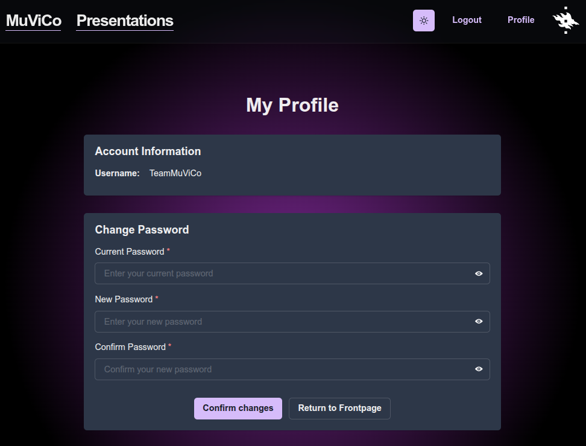

# ENJOY using MuViCo !
