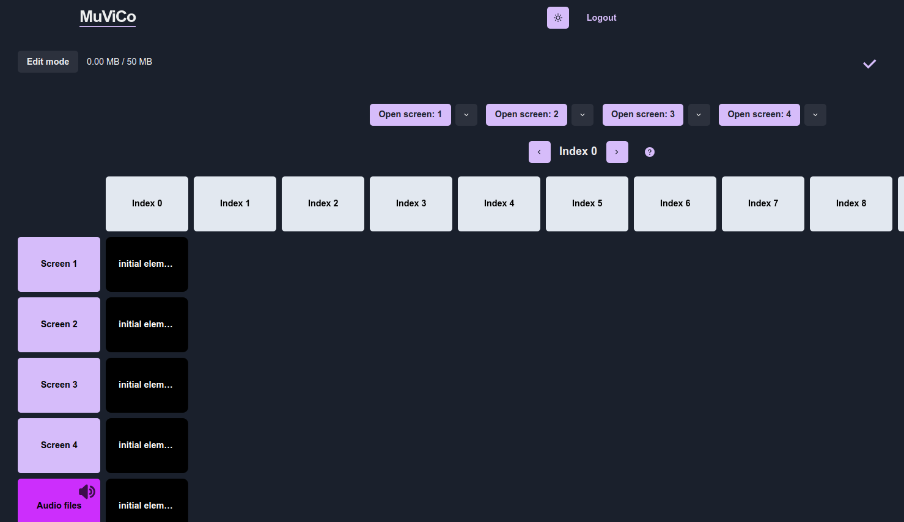

# User guide

## Instructions for using the application

Website URL: https://muvico.live/

## Login page

When you open MuViCo, the first thing you will see is the login page:

### Features on this page:

- **Login button**: Click to sign in if you already have an account.
- **Sign Up button**: Click to create a new account if you are using the app for the first time.
- **Theme button (🌙/☀️ button)**: Adjust the theme between light and dark modes.

You can learn more about the key features **(Ease of use, Multiple screens, and Remote access)** of the application by clicking the **"Learn more"** buttons at the bottom of the page.

## Home page

After signing in, you will see the **home page** where you manage your presentations:

### Features on this Page:

- **New presentation button**: Click this to create a new presentation.
- **Logout button**: Click this to log out of your account.

After creating a new presentation it will show up on the home page:

## Presentation editor

When you click on the presentation you want to edit you will be directed to the editing page of the presentation:

### Features on this page:

- **Navigation bar (top menu)**
    - **MuViCo button on the top left**: Go back to the home page.
    - **Show Mode**: Preview your presentation.
    - **Delete Presentation**: Remove the current presentation.
    - **Add Element**: Insert new elements into your slides.
    - **Storage indicator**: Displays how much space has been used (e.g., 0.00 MB / 50 MB). The maximum allowed space is 50 MB.
    - **Save status icon** (✔️): This is marked when your changes are successfully saved.

- **Slides section (top row with white boxes labeled Index 0, Index 1, etc.)**
    - This shows the order in which your elements will be displayed on the selected screen.
    - You can add up to 100 slides per screen.

- **Screens section (left side with purple boxes labeled Screen 1, Screen 2, etc. and Audio files)**
    - Displays all the screens you can use for your presentation.
    - You can use up to four screens in your presentation.
    - Audio files row where only audio media can be uploaded onto.
    - Audio files have a few extra features:
        - Loop button: click on the loop button on an audio element to have the audio tape play continuously in your presentation
        - Speaker icon: click on the Audio files box's speaker icon to mute the audio in your presentation 

- **Initial elements (black boxes labeled as initial elements)**
    - When creating a new presentation, five initial elements are added to all screens at index 0.
    - These elements can be deleted by clicking the red "X" button or modified by double-clicking on the element you want to edit.
    - These elements are added to ensure that the screens start black by default at the beginning of the presentation.

## Adding an element

You can add an element in three ways:

- Click the **"Add Element"** button to open the element creation panel.
- **Double-click** anywhere on the screen to open the panel. This will automatically set the screen and index based on where you clicked.
- **Drag and drop** a file directly to the screen.

### Steps to add an element

1. **Open the "Add Element" panel**
    - Click on the **"Add Element"** button to open the element creation panel.

2. **Select the screen**
    - Choose a screen from 1 to 4 where the new image or video element will be placed.
    - Choose screen 5 for audio elements.

3. **Select the index**
    - The index determines the element's position on the selected screen.
    - The default index will be the first available index on the selected screen.
    - You can choose any index between 0-100.

4. **Name the new element**
    - Enter a descriptive name for the element to easily identify it later.

5. **Upload media or select "Add blank"**:
    - Click **"Upload media"** to add an image or video.
    - The information button (ℹ️) will show you the **allowed file types**:
        - **Images:** .png, .bmp, .jpeg, .jpg, .jpe, .jfif, .gif, .cur, and .ico
        - **Videos:** .mp4, .webm, and ogg
        - **Audio:** .mp3 and .wav
    - You can also click **"Add blank"** to create an empty placeholder.

6. **Submit the Element**
    - Click **"Submit"** to confirm the addition of your new element to the screen.

## Editing an existing element

You can modify an element in three ways:

- Click the **"Add Element"** button and select the screen (1-5) and index (0-100) of the element you want to change.
- **Drag and drop** a new file on top of the existing element to replace it.
- **Double-click** on the element to open it for editing.

## Show mode page

When you click on the **"Show mode"** button on the **edit presentation** page you will be directed to the show mode page which allows you to preview and control your presentation in real-time. Here, you can navigate through different screens and slides (indexes).

### Features on this page:

- **Edit Mode button (top left)**: Go back to the editing screen.

- **Index navigation (middle section)**
    - **Index display (e.g., "Index 0")**: Shows the current index being played.
    - **Left ("<") and right (">") arrows**: Navigate between indexes to control the presentation flow.

- **Screen selection (purple buttons on the top labeled Open screen 1, Open screen 2, etc.)**
    - You can display a specific screen by clicking the **"Open screen"** button
      - Next to the **"Open screen"** button is an arrow that opens a dropdown menu.
          - There you can choose to mirror another screen's elements.
          - This is done to ensure that if during a presentation a monitor were to crash it is possible to show these elements on another screen. 
    - Note that the audio row cannot be opened. Audio in the presentation will start playing on its index on the speaker that has been selected as the output device in the computer that the presentation is controlled on.
 
- **Question mark info button**
    - Hovering your mouse on the question mark shows instructions on using keybinds in Show Mode.
    - Detailed instructions on keybinds [here](./Keybindings%20instructions.md "Instructions on keybinds")
