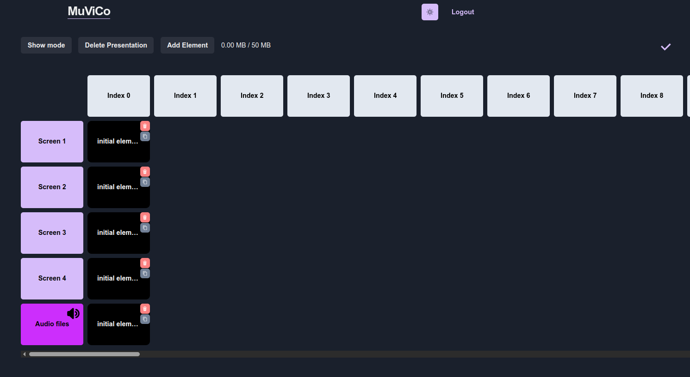

# User guide

## Instructions for using the application

Website URL: https://muvico.live/

## Login page

When you open MuViCo, the first thing you will see is the login page:

### Features on this page:

- **Login button**: Click to sign in if you already have an account.
- **Sign Up button**: Click to create a new account if you are using the app for the first time.
- **Theme button (🌙/☀️ button)**: Adjust the theme between light and dark modes.

You can learn more about the key features **(Ease of use, Multiple screens, and Remote access)** of the application by clicking the **"Learn more"** buttons at the bottom of the page.

By scrolling down, you can also access the MuViCo introduction videos and learn how it is used, all without needing to log in.

## Home page

After signing in, you will be taken to the **home page** , where you can access your existing presentations, modify them, and create new ones with ease.

### Features on this Page:

- **New presentation button**: Click this to create a new presentation.
- **Logout button**: Click this to log out of your account.
- **Delete button**: Click this to delete the presentation.

After creating a new presentation it will show up on the home page:

## Presentation editor

When you click on the presentation you want to edit you will be directed to the editing page of the presentation:

### Features on this page:

- **Navigation bar (top menu)**

  - **MuViCo button on the top left**: Go back to the home page.
  - **Show Mode**: Preview your presentation.
  - **Delete Presentation**: Delete the current presentation.
  - **Add Element**: Insert new elements into your presentation.
  - **Storage indicator**: Displays how much space has been used (e.g., 0.00 MB / 50 MB). The maximum allowed space is 50 MB.
  - **Save status icon** (✔️): This is marked when your changes have been successfully saved.

- **Frames section (top row with white boxes labeled Starting Frame, Frame 1, Frame 2, etc.)**

  - This shows the order in which your elements will be displayed on the selected screen.
  - Initially starts with 1 starting frame and 4 extra frames.
  - Additional frames can be added or removed by clicking the +/- buttons.
  - You can have anywhere from 1 to 100 frames per screen.

- **Screens section (left side with purple boxes labeled Screen 1, Screen 2, etc. and Audio files)**

  - Displays all the screens you can use for your presentation.
  - You can use multiple screens in your presentation.
  - Additional screens can be added or removed by clicking the +/- buttons.
  - The "Audio files" row is used only for audio files. Only audio files can be uploaded on this row.
  - Audio files have a few extra features:
    - Loop button: click on the loop button on an audio element to have the audio tape play continuously in your presentation.
    - Speaker icon: click on the Audio files box's speaker icon to mute the audio in your presentation.

- **Initial elements (black boxes labeled as initial elements)**
  - When creating a new presentation, initial elements are added to all screens at the starting frame.
  - These elements can be deleted by clicking the red X button or modified by either double-clicking on the element or clicking the pencil icon.
  - These elements are added to ensure that the screens start black by default at the beginning of the presentation.

## Adding an element

You can add an element in different ways:

- Click the **"Add Element"** button to open the element creation panel.
- **Double-click** anywhere on the screen to open the panel. This will automatically set the screen and frame based on where you clicked.
- **Drag and drop** a file directly to the screen.
- You can copy an existing element by clicking its **copy button**, and then click on desired positions to paste it.

### Steps to add an element

1. **Open the "Add Element" panel**

   - Click on the **"Add Element"** button to open the element creation panel.

2. **Select the screen**

   - Choose a screen from 1 up to 8 where the new image or video element will be placed.
   - Choose the highest screen number for audio elements.

3. **Select the frame**

   - The frame determines the element's position on the selected screen.
   - The default frame will be the first available frame on the selected screen.
   - You can choose any frame between 0 up to the highest in your project (max 100).

4. **Name the new element**

   - Enter a descriptive name for the element to easily identify it later.

5. **Upload media or select "Add blank"**:

   - Click **"Upload media"** to add an image or video.
   - The information button (ℹ️) will show you the **allowed file types**:
     - **Images:** .png, .bmp, .jpeg, .jpg, .jpe, .jfif, .gif, .cur, and .ico
     - **Videos:** .mp4, .webm, and ogg
     - **Audio:** .mp3 and .wav
   - You can also click **"Add blank"** to create an empty placeholder.

6. **Submit the Element**
   - Click **"Submit"** to confirm the addition of your new element to the screen.

## Editing an existing element

You can modify an element in different ways:

- Click the **"Add element"** button and select the screen (min 1, up to 8) or audio (highest screen number) and index (min 0, up to highest frame number) of the element you want to change.
- **Drag and drop** a new file on top of the existing element to replace it.
- **Double-click** on the element or click the pencil icon to open it for editing.
- Click the **delete button** to remove the element.
- **Drag and drop** the element to insert it into a new position. If there is already an element in that position, the two elements will swap places.

## Show mode page

When you click on the **"Show mode"** button on the **edit presentation** page you will be directed to the show mode page which allows you to view and control your presentation in real-time. Here you can open your screens and manually navigate between frames.

### Features on this page:

- **Edit Mode button (top left)**: Go back to the editing screen.

- **Frame navigation (middle section)**

  - **Frame display (e.g., "Starting Frame", "Frame 1", etc)**: Shows the current index being played.
  - **Left ("<") and right (">") arrows**: Navigate between frames to control the presentation flow.

- **Screen selection (purple buttons on the top labeled Open screen 1, Open screen 2, etc.)**

  - You can display a specific screen by clicking the **"Open screen"** button
    - Next to the **"Open screen"** button is an arrow that opens a dropdown menu.
      - There you can choose to mirror another screen's elements.
      - This is done to ensure that if during a presentation a monitor were to crash it is possible to show these elements on another screen.
  - Note that the audio row cannot be opened. Audio in the presentation will start playing on its index on the speaker that has been selected as the output device in the computer that the presentation is controlled on.

- **Question mark info button**
  - Hovering your mouse on the question mark shows instructions on using keybinds in Show Mode.
  - Detailed instructions on keybinds [here](./Keybindings%20instructions.md "Instructions on keybinds").
